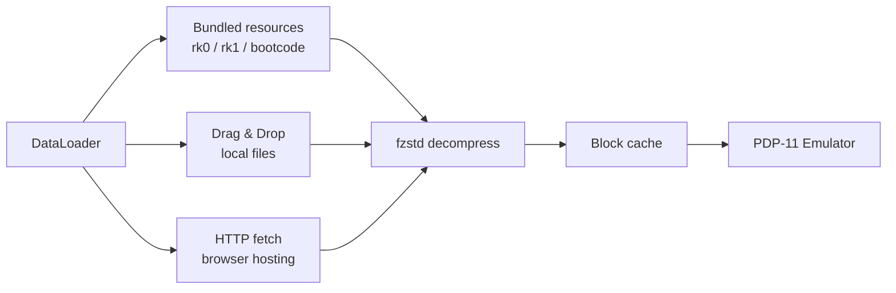

# PDP‑11 Web Emulator — with Authentic Front Panel & ASR 33 Teletype


---

## Foreword: A Personal Note

I first saw DEC minicomputers as a child at my parents' workplace. The blinking lights, the whir of disk drives, the smell of ozone and paper — it left an impression that never faded.

My real hands‑on encounter came later, when I found myself in front of the Soviet clones of DEC hardware — the **SM‑4** and **SM‑1420** — running **RSX‑11M**. And with them came C. The language that lets you feel the machine. It was love at first sight.

That was forty years ago.

I went on to become a professional programmer, eventually leading large projects. But the feeling of powering up an SM‑4 with my own hands, watching the console lights dance, then walking to the next room to sit at a terminal — that stayed with me. I've been trying to bring it back ever since.

I never got to run **real UNIX** on those machines. The Soviet replicas lived under RSX‑11M, and by the time I understood what UNIX V5 or 2.11 BSD truly meant, the world had already moved to x86 PCs. But decades later, thanks to the incredible work of Paul Nankervis, I can finally open a browser and boot Unix V5, BSD 2.11, Ultrix‑11, RSX‑11M, RSTS/E, RT‑11 — each one a time capsule of computing history.

This repository is the result. A fully fledged PDP‑11/70 emulator that runs right in your browser, with an authentic front panel and a connected **ASR 33 teletype** — the operator's console I always dreamed of having next to my desk.

Welcome to the machine.

---

## About This Project

This is a **PDP‑11/70** emulator written entirely in JavaScript. It runs in any modern browser — no plugins, no downloads, no configuration. Just open the page and you're standing in front of a DEC minicomputer.

### What makes it special

| Feature | Description |
|---------|-------------|
| **Authentic Front Panel** | Every switch, LED, and rotary knob faithfully recreated. Toggle in a bootstrap loader the way DEC engineers did in the 1970s. |
| **ASR 33 Teletype** | A fully animated Google60-style teletype connected as the operator console — complete with paper printing, keypunch sounds, line-feed whirs, and authentic nroff/man overstrike (^H) rendering. Long lines faithfully jam the carriage at the 72‑column right margin (characters overstrike the last column instead of wrapping, no scrollbar). |
| **VT52 Terminal** | A DECscope VT52 terminal (TT1:) rendered on canvas, for guest OSes that prefer video terminals. |
| **16 Guest Operating Systems** | Boot Unix V5, 2.11 BSD, Ultrix‑11, RSX‑11M (3.2 & 4.6), RSTS/E (4B‑17 through 10.1), RT‑11, XXDP diagnostics, and more. |
| **Persistent Disk Images** | All disk and tape images are preloaded. Changes to disk contents persist in browser storage across sessions. |
| **Paper Tape Reader** | Load BASIC‑11, ODT‑11, ED‑11, or Lunar Lander from simulated paper tape. |

### Live Demo

- [**PDP‑11/70**](https://paulnank.github.io/pdp11-js/pdp11.html)

---

## Desktop App (Tauri)

The same emulator is packaged as a native desktop application with [Tauri v2](https://tauri.app/).
It runs fully offline. Two installer variants are published, so users can pick between a tiny
download and a fully-offline bundle with every disk/tape image:

| Variant | Ships | Notes |
|---------|-------|-------|
| **Minimal** | `rk0`, `rk1`, `bootcode` | Small download (~3 MB). All other images are **dragged & dropped** at runtime. |
| **Full** | every image — RK/RL/RP/RA disks, TM tapes, all paper tapes | Larger download, but all 16 guest OSes boot offline with zero extra steps. |

### Artifacts (Windows x64)

| Artifact | Size |
|----------|------|
| `PDP-11 Minimal_0.1.0_x64-setup.exe` (NSIS) / `.msi` (WiX) / `PDP-11 Minimal.exe` | ~3.2 MB / ~4.3 MB / ~6.2 MB |
| `PDP-11 Full_0.1.0_x64-setup.exe` (NSIS) / `.msi` (WiX) / `PDP-11 Full.exe` | ~84 MB / ~85 MB / ~6.2 MB |

### Bundled images

The **Minimal** build bundles:

| Image | OS | How to Boot |
|-------|----|-------------|
| `rk0.dsk` | Unix V5 | `boot rk0` → `unix` → login `root` |
| `rk1.dsk` | RT‑11 v4.0 | `boot rk1` |
| `bootcode.ptap` | Bootstrap loader | loaded via Paper Tape reader |

The **Full** build additionally bundles all `rk2`–`rk5`, `rl0`–`rl3`, `rp0`–`rp4`, `ra0`–`ra2`,
`tm0`–`tm2` and the remaining paper tapes (`DEC-11-AJPB-PB`, `DEC-11-O2PA-PB`, `ED-11-V004B-8K`,
`lander`) — see the [guest OS table](#guest-operating-systems) for how to boot each one.

In either build, any image not shipped can be loaded at runtime by **dragging the file** onto the
drop zone in the control bar — `.dsk`, `.tap`, `.ptap` and their `.zst`-compressed forms are
supported. Mounted images persist in IndexedDB and are re-mounted automatically on the next launch.

### How image loading works



### Building the desktop app

Prerequisites (Windows): Rust (MSVC toolchain), Visual Studio 2019/2022 with "Desktop
development with C++", WebView2 (built into Windows 11), `tauri-cli`
(`cargo install tauri-cli --version "^2"`), and Node.js >= 18.

The build is orchestrated through npm scripts — the repo has no npm dependencies,
just plain Node tooling. Run `npm run` to list every target:

| Script | Action |
|--------|--------|
| `npm run stage` | Stage the lightweight frontend (excludes heavy `media/`) into `desktop/`; default variant is `minimal` |
| `npm run desktop` / `desktop:minimal` | Stage + build installers (MSI + NSIS + portable exe), `minimal` variant (rk0/rk1/bootcode) |
| `npm run desktop:full` | Stage + build installers with every disk/tape image bundled |
| `npm test` | Run the modular tests (Config + DataLoader + onboarding + VT52 overstrike logic) |
| `npm run serve` | Local static server on port 1170 (HTTP Range supported) for browser development |
| `npm run clean` | Remove `desktop/` and the generated `tauri.conf.json` |

```bash
# Build the full desktop app (stage + installers) in one step
npm run desktop:full

# Or manually: stage only
npm run stage -- --variant full

# Serve the browser version for development
npm run serve
```

`tools/build-desktop.js` (invoked by the `stage`/`desktop*` scripts) copies the matching
`src-tauri/tauri.conf.<variant>.json` over `src-tauri/tauri.conf.json` (gitignored) so
`cargo tauri build` picks up the right set of bundled resources. Re-run the staging step
after any web-source change before rebuilding.

The installers are branded with a themed PDP-11 front-panel artwork (dark cabinet,
"11" lettering, indicator lamps, toggle switches) that ships as static
`src-tauri/installer/*.bmp`:

| Image         | Size    | Used by                                                     |
|---------------|---------|-------------------------------------------------------------|
| `sidebar.bmp` | 164x314 | NSIS — left sidebar of the Welcome/Finish pages             |
| `banner.bmp`  | 493x58  | MSI (WiX) — banner strip on every wizard page               |
| `dialog.bmp`  | 493x312 | MSI (WiX) — Welcome/Finish dialog body                      |

All three are BMP because NSIS Modern UI 2 and the WiX UI extension require that
format. They are wired in via `bundle.windows.nsis.sidebarImage` and
`bundle.windows.wix.bannerPath` / `bundle.windows.wix.dialogImagePath` in
`src-tauri/tauri.conf.minimal.json` / `src-tauri/tauri.conf.full.json`.

---

## Guest Operating Systems

The emulator ships with ready-to-boot disk and tape images. Just type `boot <device>` at the `Boot>` prompt.

| Disk | Operating System | How to Boot |
|------|-----------------|-------------|
| **RK0** | Unix V5 | `boot rk0` → `unix` → login as `root` |
| **RK1** | RT‑11 v4.0 | `boot rk1` |
| **RK2** | RSTS V06C‑03 | `boot rk2` — login `11,70` password `PDP` |
| **RK3** | XXDP (diagnostics) | `boot rk3` |
| **RK4** | RT‑11 3B Distribution | `boot rk4` |
| **TM0** | RSTS 4B‑17 (tape) | `boot tm0` — follow ROLLIN restore procedure |
| **RL0** | BSD 2.9 | `boot rl0` → `rl(0,0)rlunix` → CTRL/D → login `root` |
| **RL1** | RSX‑11M v3.2 | `boot rl1` — login `1,2` password `SYSTEM` |
| **RL2** | RSTS/E v7.0 | `boot rl2` — login `11,70` password `PDP` |
| **RL3** | XXDP (extended) | `boot rl3` |
| **RP0** | ULTRIX‑11 V3.1 | `boot rp0` → CTRL/D → login `root` |
| **RP1** | BSD 2.11 | `boot rp1` — autoboots to multiuser, login `root` |
| **RP2** | RSTS/E v9.6 | `boot rp2` — answer prompts, login `11,70` |
| **RP3** | RSX‑11M v4.6 | `boot rp3` — auto-logs `1,2` SYSTEM |
| **RP4** | RSTS/E v10.1 | `boot rp4` — answer prompts, login `11,70` |

> Full boot session logs for every OS can be found in [`docs/ExampleBoots.md`](docs/ExampleBoots.md).

---

## Quick Start

1. Open the [PDP‑11/70 emulator](https://paulnank.github.io/pdp11-js/pdp11.html).
2. At the `Boot>` prompt, type `boot rp1` and press ENTER.
3. BSD 2.11 will autoboot into multiuser mode. Login as `root` (no password).
4. Try `ls`, `ps -aux`, `df` — or compile a C program with `cc`.

### Switching pages

Use the sidebar to switch between:
- **Panel** — the front panel with switches and LEDs
- **Console** — the operator console: an ASR 33 teletype (when the console terminal is a teletype)
- **Console** — the operator console: a DECscope VT52 (when the console terminal is a VT52)
- **TTY 1 / TTY 2** — user VT52 terminals, shown only when configured
- **Printer** — the LP11 line printer page, shown only when configured
- **Config** — configure the emulated peripherals (persisted between sessions)
- **Info** — detailed instructions and OS reference

The **Config** page controls the console terminal type (teletype or VT52), the
number of user terminals (0–2), the presence of the LP11 line printer, the
teletype/printer print widths (72/80/100/132) and optional VT100-style key-click
sound for VT52 terminals. The LP11 line printer defaults to the authentic
132-column width. Structural changes (console type, terminals, printer)
restart the machine so the emulated hardware matches the configuration; print
widths and the key click apply immediately. A **Restore defaults** button resets
every setting to its factory value.

The same page hosts the **Machine** section: **Reboot**, the paper-tape reader file
selector, the drag & drop image drop zone and the mounted-images/Unmount list.

The **Printer** page renders the LP11 output on an animated paper machine (no
keyboard) and offers **Print** (send the accumulated jobs to the real OS printer
via the system dialog) and **Save .txt** buttons. Like the real LP11, it echoes
characters far faster than the ASR 33 console teletype (the console keeps its
authentic ~33 cps pacing) and prints on a wide 132-column paper at close to the
original's ~300 lines/min. Both the teletype and the printer advance the
carriage to the next 8-column tab stop on TAB, matching real ASR 33 / LP11
behaviour.

### A simple light chaser

Toggle this into the front panel to see the address and data LEDs dance:

```
Switch sequence: HALT, 001000, LOAD ADDRESS
                 012700, DEPOSIT
                 000001, DEPOSIT
                 006100, DEPOSIT
                 000005, DEPOSIT
                 000775, DEPOSIT
                 001000, LOAD ADDRESS, ENABLE, START
```

### Restart the bootloader

```
HALT, 120000, LOAD ADDRESS, ENABLE, START
```

---

## Project Architecture

| File | Purpose |
|------|---------|
| [`src/pdp11.js`](src/pdp11.js) | Core CPU emulation (PDP‑11/70 & /45 instruction set, MMU, interrupts) |
| [`src/fpp.js`](src/fpp.js) | Floating‑Point Processor (FP11) emulation |
| [`src/iopage.js`](src/iopage.js) | I/O page — disk controllers, terminal interfaces, paper tape reader, line printer |
| [`src/pdp11-panel.js`](src/pdp11-panel.js) | Front panel rendering and switch interaction |
| [`src/pdp11-app.js`](src/pdp11-app.js) | Application glue — boots the emulator, wires the configured teletype/VT52 console, user terminals, printer and the CONFIG page |
| [`src/config.js`](src/config.js) | User configuration (CONFIG page) — validated, persisted in localStorage |
| [`src/vt52.js`](src/vt52.js) | DECscope VT52 terminal emulation (canvas‑based); renders nroff/man overstrike as bold/underline |
| [`src/g60printer.js`](src/g60printer.js) | Google60-style teletype printer (ASR 33 / LP11) |
| [`src/vt11.js`](src/vt11.js) | Vector graphics VT11 display |
| [`src/bootcode.js`](src/bootcode.js) | The custom bootstrap loader program |
| [`src/dragdrop.js`](src/dragdrop.js) | Drag & drop disk/tape image import — mounts files into DataLoader, persists them in IndexedDB |
| [`src/tauri-bundled.js`](src/tauri-bundled.js) | Tauri desktop: loads the bundled boot images via the Rust `load_bundled_image` command |
| [`tests/config.test.js`](tests/config.test.js) | Config validation/persistence modular tests — run with `node tests/config.test.js` |
| [`tests/dataloader.test.js`](tests/dataloader.test.js) | DataLoader/`fetchBlock` modular tests — run with `node tests/dataloader.test.js` |
| [`tests/vt52.test.js`](tests/vt52.test.js) | VT52 overstrike (bold/underline) modular tests — run with `node tests/vt52.test.js` |
| [`css/pdp11.css`](css/pdp11.css) | Front panel and application styles |
| [`css/g60printer.css`](css/g60printer.css) | Teletype printer styles |
| [`tools/build-desktop.js`](tools/build-desktop.js) | Stages the lightweight Tauri frontend into `desktop/`; `--variant minimal\|full` selects which bundled media images to ship |
| [`tools/serve.js`](tools/serve.js) | Minimal static file server for the browser emulator (port 1170, HTTP Range support) |
| [`package.json`](package.json) | npm build scripts — `test`, `stage`, `desktop`/`desktop:minimal`/`desktop:full`, `serve`, `clean` |
| [`src-tauri/`](src-tauri/) | Tauri v2 desktop shell — Rust commands, `tauri.conf.minimal.json` / `tauri.conf.full.json`, bundled resources, app icons |
| [`assets/vendor/fzstd.js`](assets/vendor/fzstd.js) | Bundled fzstd (ZSTD decompression) — served locally instead of an external CDN so disk/tape images decompress reliably on any network |

### Media files

Disk (`.dsk`), tape (`.tap`), and paper tape (`.ptap`) images live in the [`media/`](media/) directory. Many are ZST‑compressed to stay within GitHub size limits. Disk and tape images ship as `.zst` and are fetched and decompressed in the browser via the bundled fzstd library (no raw `.dsk`/`.tap` copy is required). See [`media/README.md`](media/README.md) for the naming convention.

---

## Acknowledgments

This project stands on the shoulders of giants.

### Paul Nankervis — Original PDP‑11 Emulator

Paul wrote the original [pdp11-js](https://github.com/paulnank/pdp11-js) emulator, which this repository is forked from. His meticulous work — cycle‑accurate CPU emulation, beautifully rendered front panels, and a meticulously curated collection of vintage operating systems — made this project possible. His story about chasing the RSTS/E console light pattern is legendary among DEC enthusiasts.

> *"I met my core objective — I can now see the RSTS/E console light pattern that I was looking for."*
> — Paul Nankervis

### Norbert Landsteiner (mass:werk) — Google60 Teletype

The ASR 33 teletype emulation is adapted from [**Google60**](https://www.masswerk.at/google60/) by **Norbert Landsteiner** of [mass:werk](https://www.masswerk.at/). Google60 is a brilliant simulation of the Google search interface as it would have appeared on a ASR 33 Teletype in the 1960s/1970s. Norbert's meticulous implementation — from the 3D keycaps to the paper advance animation and authentic sound effects — brings the teletype to life. This project repurposes his engine as the operator console for the PDP‑11.

His work is a masterclass in retro‑UI simulation. Thank you, Norbert.

### Additional Sources

- [**Bitsavers**](http://bitsavers.org/pdf/dec/pdp11/) — DEC PDP‑11 documentation archive
- [**Bitsavers Software**](http://bitsavers.org/bits/DEC/pdp11/) — PDP‑11 software and disk images
- [**The Unix Heritage Society (TUHS)**](https://www.tuhs.org/) — Preserving UNIX history
- [**RSTS.ORG**](http://www.rsts.org/) — RSTS/E community and software preservation

---

## Links

| Resource | URL |
|----------|-----|
| Original pdp11-js | <https://github.com/paulnank/pdp11-js/> |
| Google60 (mass:werk) | <https://www.masswerk.at/google60/> |
| mass:werk | <https://www.masswerk.at/> |
| Bitsavers (docs) | <http://bitsavers.org/pdf/dec/pdp11/> |
| Bitsavers (software) | <http://bitsavers.org/bits/DEC/pdp11/> |
| TUHS | <https://www.tuhs.org/> |

---

*Happy emulating!*

— Paul Nankervis (*original author*)  
— *Fork maintained with love for the DEC era*
