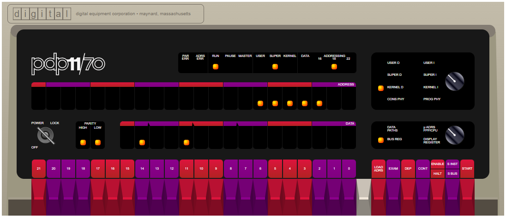
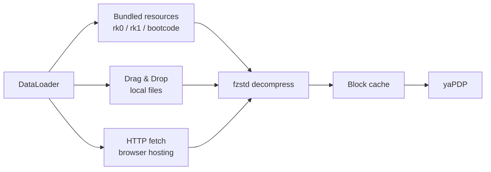

# yaPDP — Yet Another PDP‑11/70 Web Emulator, with Authentic Front Panel & Model 33 ASR Teletype



---

## Foreword: A Personal Note

I first saw DEC minicomputers as a child, and later worked hands‑on with their Soviet clones — the **SM‑4** and **SM‑1420** running **RSX‑11M**. Decades later, thanks to the incredible work of Paul Nankervis, it is possible to boot Unix V5, BSD 2.11, Ultrix‑11, RSX‑11M, RSTS/E and RT‑11 in a browser.

This repository is the result: **yaPDP**. Welcome to the machine.

---

## About This Project

This is **yaPDP**, a **PDP‑11/70** emulator written entirely in JavaScript. It runs in any modern browser — no plugins, no downloads, no configuration. Just run the emulator and you're standing in front of a DEC minicomputer.

### What makes it special

| Feature | Description |
|---------|-------------|
| **Authentic Front Panel** | Every switch, LED, and rotary knob faithfully recreated. Toggle in a bootstrap loader the way DEC engineers did in the 1970s. |
| **Model 33 ASR Teletype** | A fully animated teletype drawn as an authentic Model 33 ASR — a light cream/beige cabinet with a paper roll (behind the rising sheet), a glass carriage window and a stamped Teletype Corporation logo on the lower face plate — connected as the operator console with a faithful Model 33 ASR keyboard: round dark keycaps with light two-line legends (the base glyph centred, the CTRL-code name or shift symbol above), and the historical special keys ESC, LINE FEED, RETURN, DELETE (RUB OUT — with the punch engaged it punches the all-holes DEL row on the tape), HERE IS (answerback), REPT (auto-repeat) and BREAK (asserts the console DL11 break condition). Upper Case Only: the on-screen keycaps send only upper-case letters; the physical keyboard folds a-z to A-Z when the **Upper Case Only** CONFIG option is enabled (off by default, so 2.11 BSD receives lower case) — complete with paper printing, keypunch sounds, line-feed whirs, and authentic nroff/man overstrike (^H) rendering: re-printing the same glyph gives bold, underscores give underline, and striking a *different* glyph (e.g. a 2.11 BSD boot countdown) leaves the real dark overstrike blot a hard-copy terminal makes. Long lines faithfully jam the carriage at the right margin (72 or 80 columns; characters overstrike the last column instead of wrapping, no horizontal scrollbar), and the paper width follows the selected width so a full line reaches the paper edge. Like the LP11 page, the console paper is anchored to the carriage and **grows upward**: it rises out of the top of the machine body until its edge reaches the top of the window, at which point the paper's own scrollbar appears and the view follows the freshly printed line. Beside the machine sits the ASR tape **reader/punch** unit: every byte echoed to the console punches a matching row of holes on an 8-track paper tape (tracks 1–7 = ASCII, track 8 = parity, feed holes between tracks 3/4), which grows downwards and gains a scrollbar once it fills the window. As on a real ASR-33 the punch is **OFF by default**: it engages via the **ON** button on the TAPE PUNCH cabinet (or when the machine sends **DC2 / 0x12**) and disengages via **OFF** (**DC4 / 0x14**); **BSP** pulls the tape back one step — the hanging tail visibly shortens as the last punched row disappears into the punch unit — and the next punch overpunches the row now under the punch head, the holes OR-ing together exactly like real hardware: **DELETE** (RUB OUT) punches all holes and turns the byte into DEL, any other key corrupts it the same way it would on a real ASR-33. **REL** releases it. The TAPE READER reads a loaded tape into the machine: **Load tape** opens a file dialog for a raw `.ptap`, a compressed `.ptap.zst`, or a `.txt` (its characters become 7-bit tape codes), and the full tape hangs from the reader slot down to the window edge, its ragged free end torn like the punched tape's. The four-position switch (**START / STOP / FREE / AUTO**, **STOP by default**) governs reading: START runs the reader continuously at the console speed; AUTO sends one byte and feeds the next only when the machine's DL11 has accepted the previous one, pausing on **DC3 / X-OFF (0x13)** and resuming on **DC1 / X-ON (0x11)**; STOP pauses; **STOP** and **FREE** both show the **Remove tape** button (hidden while the reader is START or AUTO, so a tape is never pulled out mid-run; FREE is now a purely decorative switch position). **Load tape** always switches the reader to **STOP** first, so a freshly loaded tape never starts feeding on its own. The CCU routes every read byte exactly like the keyboard: in **LOCAL** the tape prints on paper only (tape-to-paper copy), in **LINE** it is sent to the machine and printed by the machine's echo. With the punch engaged, every read byte is also punched onto the output tape — the classic ASR trick for duplicating tapes. As the tape is read it moves up through the slot and shortens; when the last byte is read the tape has gone into the machine and a new one can be loaded. Mode is chosen with the **Call Control Unit (CCU)** rotary knob on the apron right of the keyboard — **LINE / OFF / LOCAL** (LINE connects to the machine, OFF powers the whole unit down — teletype, punch and reader — and LOCAL prints the keyboard locally while ignoring the machine line). Operator controls below the machine switch **Tear tape** / **Tear paper** (tear off the punched tape / printed paper) and **Save tape** (download the punched bytes as a `.ptap`). The console echo speed is selectable in the CONFIG page: **authentic 110 baud (~10 chars/sec)** or a fast development pace (~33 chars/sec). |
| **Authentic LP11 Line Printer** | A faithful recreation of the DEC line printer that stood beside real PDP‑11s — beige/grey cabinet, fanfold paper, ON LINE lamp and TOP OF FORM / PAPER FEED controls, printing at a near‑authentic ~300 lines/min. The accumulated job can be handed to your real printer via the system dialog (**Print**) or exported as a **.txt** file — hardcopy, just as it left the machine room. |
| **VT52 Terminal** | A DECscope VT52 terminal (TT1:) rendered on canvas with its authentic white/grey (P4) phosphor on a black tube — an optional reverse-video mode swaps it to black text on white — for guest OSes that prefer video terminals. The terminal is drawn as an authentic slanted DECscope monoblock: an off-white moulded-plastic cabinet with a vent grille, a recessed screen in a deep bezel and a plain plastic side panel with a raised ridge; input comes from the physical keyboard, as on the original DECscope. Text is rendered in the authentic `fritzm/vt52` bitmap display font (`monospace` is the fallback until the webfont loads). The cabinet scales down proportionally to fit the window. Clear screen (ESC E) and form feed (^L) both wipe the display and home the cursor, so `clear` and multi-page nroff/man output start each page from the top row. An optional pure-CSS CRT simulation adds brightness flicker, scanline shimmer and a vertical-hold roll band. An optional **text mode** renders the terminal as a plain text field instead of the canvas, enabling native text selection and Windows Clipboard (Ctrl+C / Ctrl+V / right-click paste) for fast source-code entry — at the cost of the SGR emphasis rendering. |
| **VT11 Display** | An optional DEC VT11 vector-graphics display processor on its own green-phosphor CRT page (1024x768 logical resolution, auto-scaled to fit the window), enabled from the CONFIG page. |
| **16 Guest Operating Systems** | Boot Unix V5, 2.11 BSD, Ultrix‑11, RSX‑11M (3.2 & 4.6), RSTS/E (4B‑17 through 10.1), RT‑11, XXDP diagnostics, and more. |
| **Persistent Disk Images** | All disk and tape images are preloaded. Changes to disk contents persist in browser storage across sessions. |
| **Paper Tape Reader** | Load BASIC‑11, ODT‑11, ED‑11, or Lunar Lander from simulated paper tape. |

### Live Demo

- [**yaPDP**](https://paulnank.github.io/pdp11-js/pdp11.html)

The repository root also contains [`index.html`](index.html) — a landing page in the
same DEC style as the emulator itself, telling the story behind the project and
linking to the live demo, the source code and the original authors — and
[`manual.html`](manual.html), a step-by-step user manual in the same DEC style,
linked from the landing page.

---

## User Manual

[`manual.html`](manual.html) is a step-by-step user guide in the same DEC style
as the landing page: quick boot (magic wand), the front panel, the Model 33 ASR
operator console, VT52 terminals, the LP11 line printer, storage, configuration
and every guest OS boot command. Its page illustrations are live screenshots of
the emulator, regenerated with:

```bash
npm install               # installs the puppeteer-core devDependency
npm run screenshots:manual
```

The generator (`tools/screenshots-manual.js`) starts the repository's own static
server, drives the locally installed Edge/Chrome with `puppeteer-core` (no
Chromium download) and writes 1280x800 PNGs into `assets/images/manual/`.

The landing page shows a carousel of guest-OS screenshots (Unix V5, 2.11 BSD,
RT-11 — on both the teletype and a VT52 console, DEC BASIC, Lunar Lander,
XXDP+ diagnostics). They are produced by
[`tools/screenshots-os.js`](tools/screenshots-os.js), which boots each OS
through the quick-boot wizard, waits for the OS to become ready, types a demo
command and captures a PNG:

```bash
npm run screenshots:os          # all five guest-OS shots
npm run screenshots:os bsd      # a single shot (file name or device key)
```

Short demonstration videos (guest-OS boots, the LP11/printer/paper-tape
hardware, the VT11 Lunar Lander) are recorded by
[`tools/record-video.js`](tools/record-video.js) with `puppeteer-stream` — a
WebRTC tab-capture bridge that records both video and the in-tab audio
(teletype chatter, LP11 buzz, power-supply hum) into a WebM file. Both the
screenshot and video generators share [`tools/console-wait.js`](tools/console-wait.js):
a render hook (fed by the console's `onChar` in `src/pdp11-app.js`) makes them
wait until the teletype has REALLY printed the output, so captures never cut
mid-print:

```bash
npm install                     # installs puppeteer-stream + ffmpeg-static
npm run record:video            # all guest-OS clips
npm run record:video rt11       # a single clip (file name or device key)
npm run record:video -- --headed  # force a visible window (most reliable audio)
```

Output: `video/<name>.webm` (the `video/` folder is gitignored so generated
clips never reach the published site).

The per-OS clips are then assembled into a single promotional reel by
[`tools/assemble-video.js`](tools/assemble-video.js) with the bundled
`ffmpeg-static`: a canvas-rendered intro card, per-OS title cards (the landing
page's machine-room photo over a dark DEC card, "70% transparent"), cross-fades
between every segment, and quiet background music that loops for the whole
length of the reel (`assets/sounds/Mirror Mind - Bobby Richards.mp3` by default,
or `--music <file>`).

The intro card is generated frame-by-frame with `node-canvas` by
[`tools/make-intro.js`](tools/make-intro.js): a bold amber-glowing "YAPDP" over
the machine-room photo, a green-phosphor line typed out with a blinking cursor,
CRT scanlines, fade-in / hold / fade-out, and synthesized keypress ticks:

```bash
npm run video:intro                     # render video/yapdp-intro.webm
npm run video:demo                      # reel + individual clips, default track
npm run video:demo -- --music loop.mp3  # or override the music
```

Output (all YouTube-ready MP4, H.264 + AAC):
- `video/yaPDP-demo.mp4` — the full promotional reel (1280x800);
- `video/<name>.mp4` for every guest OS — the `yapdp-intro` card cross-faded
  into the clip with the same quiet background music, so each operating system
  can be uploaded to YouTube individually.

Every MP4 (individual clips and the reel alike) ends with a black outro card
showing the project URL (`https://amesk.github.io/yaPDP/`) with CRT scanlines,
fading out at the very end. A single clip can be rebuilt alone:
`node tools/assemble-video.js lander`.

---

## Desktop App (Tauri)

The same emulator is packaged as a native desktop application with [Tauri v2](https://tauri.app/).
It runs fully offline. Two installer variants are published, so users can pick between a tiny
download and a fully-offline bundle with every disk/tape image:

| Variant | Ships | Notes |
|---------|-------|-------|
| **Minimal** | `rk0`, `rk1`, `bootcode` | Small download (~3 MB). All other images are **dragged & dropped** at runtime. |
| **Full** | every image — RK/RL/RP/RA disks, TM tapes, all paper tapes | Larger download, but all 16 guest OSes boot offline with zero extra steps. |

### Artifacts (Windows x64)

| Artifact | Size |
|----------|------|
| `yaPDP-Minimal_0.1.0_x64-setup.exe` (NSIS) / `.msi` (WiX) / `yaPDP-Minimal.exe` | ~3.2 MB / ~4.3 MB / ~6.2 MB |
| `yaPDP-Full_0.1.0_x64-setup.exe` (NSIS) / `.msi` (WiX) / `yaPDP-Full.exe` | ~84 MB / ~85 MB / ~6.2 MB |

### Artifacts (Linux x64)

Built on Linux (no cross-compilation — see below). `.deb` for Debian/Ubuntu
family, `.rpm` for Fedora/RHEL/openSUSE, `.AppImage` is the portable
download-and-run format (the analogue of the Windows portable `.exe`):

| Artifact | Size |
|----------|------|
| `yaPDP-Minimal_0.1.0_amd64.deb` / `.rpm` / `.AppImage` | ~13.5 MB / ~13.5 MB / ~88 MB |
| `yaPDP-Full_0.1.0_amd64.deb` / `.rpm` / `.AppImage` | ~97.5 MB / ~97.5 MB / ~172 MB |

### Bundled images

The **Minimal** build bundles:

| Image | OS | How to Boot |
|-------|----|-------------|
| `rk0.dsk` | Unix V5 | `boot rk0` → `unix` → login `root` |
| `rk1.dsk` | RT‑11 v4.0 | `BOOT RK1` |
| `bootcode.ptap` | Bootstrap loader | loaded via Paper Tape reader |

The **Full** build additionally bundles all `rk2`–`rk5`, `rl0`–`rl3`, `rp0`–`rp4`, `ra0`–`ra2`,
`tm0`–`tm2` and the remaining paper tapes (`DEC-11-AJPB-PB`, `DEC-11-O2PA-PB`, `ED-11-V004B-8K`,
`lander`) — see the [guest OS table](#guest-operating-systems) for how to boot each one.

In either build, any image not shipped can be loaded at runtime by **dragging the file** onto the
drop zone in the control bar — `.dsk`, `.tap`, `.ptap` and their `.zst`-compressed forms are
supported. Mounted images persist in IndexedDB and are re-mounted automatically on the next launch.

### How image loading works



On a static host, disk/tape images are fetched from the `media/` directory
**relative to the emulator page** (`fetch("media/…")`), not from `../media/`.
Keeping the path page-relative is what lets the emulator run when the repository
is served from a subpath — e.g. GitVerse Pages publishes it under `/yapdp/`,
where `../media` would resolve one level too high and hit the SPA fallback page
instead of the real binary file.

### When an image cannot be loaded

If a guest OS image cannot be fetched completely — a big BSD image dropped by
the hosting server mid-download, or an image that is not bundled in the
**Minimal** desktop build — the emulator doesn't stall silently. A dialog in
the same shared modal style as the first-run hint explains that the image is
incomplete and offers **Open Storage**, which jumps straight to the Drop zone
for a manual drag & drop of the downloaded file. Detection covers truncated
HTTP responses (a `Content-Length` mismatch or an empty body) and corrupted or
partial `.zst` data that `fzstd` cannot decompress.

The wording adapts to the environment: a page opened as a local `file://`
explains that the browser blocks fetching the media directory (and suggests a
local web server), while the Tauri **Minimal** build explains that the image is
not shipped and points to the Drop zone.

### Quick boot (magic wand)

A magic-wand button in the top-right corner of the window (visible on every
page except the **Info** page) opens a picker for every guest OS. The
first-run welcome dialog also has a **Quick boot** button that opens the same
picker directly. Choosing one
switches to the operator console,
reboots the machine and types `boot <dev>` — and where the credentials are
known, the login too (e.g. Unix V5: `boot rk0` → `unix` → `root`). The boot
sequences live in [`src/osboot.js`](src/osboot.js) (a hand-curated
machine-readable config, so the picker never has to parse the free-text Info
table); the flow itself is implemented in [`src/quickboot.js`](src/quickboot.js)
and feeds the console through the same input queue the physical keyboard uses.

Login steps are prompt-aware: instead of firing on a timer, the wizard watches
the console output and types only when the guest prints `login:` (with a
timeout fallback), so slow boots with lots of output (e.g. 2.11 BSD) still
reach the login prompt reliably.

Each OS also declares the machine profile it wants (`hardware` in
`src/osboot.js`): e.g. Unix V5 / BSD / RT-11 / ULTRIX force a teletype
console, and RT-11 / RSX / RSTS enable the LP11 line printer. If the current
configuration differs, the wizard applies the profile (like the CONFIG Apply
button), reloads, and resumes the boot automatically.

Paper tapes (BASIC-11, ODT-11, ED-11, Lunar Lander) live in the same picker:
the wizard selects the tape in the Storage `#ptr` select and boots it via
`BOOT PR`. Lunar Lander additionally enables the VT11 vector display and
switches to the **Display** page so the landing module is visible.

Each wizard boot starts "on a fresh page": the teletype and LP11 paper, the
ASR paper tape and the VT52 screens are cleared before the machine reboots,
so the boot banner lands on clean output. While the sequence is being typed
a small toast warns
"Autoloading in progress — don't touch the teletype/keyboard"; it disappears
when the boot finishes, as soon as the operator presses any key, or the moment
an image fails to load (the wizard stops typing and the "Image load
interrupted" dialog takes over).

### Installing the toolchain (Windows)

Building the desktop app on a fresh Windows machine requires the following
components:

1. **Node.js ≥ 18** — download the LTS release from <https://nodejs.org>, or
   `winget install OpenJS.NodeJS.LTS`.
2. **Rust (MSVC toolchain)** — install via <https://rustup.rs>
   (or `winget install Rustlang.Rustup`); the default host target
   `stable-x86_64-pc-windows-msvc` is exactly what this project needs.
3. **Microsoft C++ Build Tools / Visual Studio 2019 or 2022** with the
   **"Desktop development with C++"** workload — both the Rust MSVC linker and
   the Tauri CLI require it. The Community edition is free and sufficient.
4. **WebView2 Runtime** — built into Windows 11; on Windows 10 install the
   Evergreen Runtime from the
   [Microsoft WebView2](https://developer.microsoft.com/microsoft-edge/webview2/)
   page.
5. **Tauri CLI v2** — `cargo install tauri-cli --version "^2"`.

Verify every component is on the `PATH` before building:

```bash
node --version    # >= 18
cargo --version   # stable MSVC toolchain
cargo tauri --version
```

The Tauri bundler downloads the WiX and NSIS tools automatically on the first
build, so no extra setup is needed to produce the `.msi` and `.exe` installers.
Then stage and build either variant:

```bash
npm run desktop:minimal   # yaPDP-Minimal: rk0/rk1/bootcode
npm run desktop:full      # yaPDP-Full: every disk/tape image
```

### Installing the toolchain (Linux)

Building on Linux follows the same recipe, with one important difference:
**there is no cross-compilation** — the Tauri bundler packages the app for the
platform it runs on, so `.deb`/`.rpm`/`.AppImage` artifacts must be built on a
Linux machine (building a Windows installer from Linux is not supported).

1. **Node.js ≥ 18** — `sudo apt install nodejs npm`, or the LTS from
   <https://nodejs.org>.
2. **Rust** — install via <https://rustup.rs>:
   ```bash
   curl --proto '=https' --tlsv1.2 -sSf https://sh.rustup.rs | sh
   ```
3. **Tauri system dependencies** (Debian/Ubuntu; other distros — see the
   [Tauri prerequisites](https://v2.tauri.app/start/prerequisites/)):
   ```bash
   sudo apt install libwebkit2gtk-4.1-dev build-essential curl wget file \
     libxdo-dev libssl-dev libayatana-appindicator3-dev librsvg2-dev
   ```
4. **Tauri CLI v2** — `cargo install tauri-cli --version "^2"`.

Verify every component is on the `PATH`, then stage and build either variant:

```bash
node --version            # >= 18
cargo --version
cargo tauri --version

npm run desktop:minimal   # yaPDP-Minimal: deb + AppImage
npm run desktop:full      # yaPDP-Full: deb + AppImage
```

The first build downloads the AppImage tooling (linuxdeploy) automatically.
The `.deb` installs system-wide via `apt`/`dpkg` (Debian/Ubuntu family); the
`.AppImage` is the Linux analogue of the portable `.exe` — download, `chmod +x`,
run, no installation required. Runtime dependencies of the `.deb` (WebKitGTK,
GTK3, …) are pulled in automatically by the package manager.

### Building the desktop app

Once the [toolchain above](#installing-the-toolchain-windows) is installed, the
build is orchestrated through npm scripts — the only npm dependency is the
`puppeteer-core` devDependency behind the manual-screenshot tool. Run
`npm run` to list every target:

| Script | Action |
|--------|--------|
| `npm run stage` | Stage the lightweight frontend (excludes heavy `media/`) into `desktop/`; default variant is `minimal` |
| `npm run desktop` / `desktop:minimal` | Stage + build installers for the current platform (Windows: MSI + NSIS + portable exe; Linux: deb + AppImage), `minimal` variant (rk0/rk1/bootcode) |
| `npm run desktop:full` | Stage + build installers with every disk/tape image bundled |
| `npm test` | Run the modular tests (Config + clipboard paste (PasteUtil) + DataLoader + onboarding + image-load error + quick-boot scenarios + VT52 (overstrike + escape sequences) + LP11 text + LP11 scaling + front-panel scaling + teletype scaling + LP11 ON LINE/DONE/ERROR semantics + teletype paper growth (CSS contract + `teletypePaperMaxHeight` helper) + teletype cabinet/keycaps CSS contract + VT52 cabinet CSS sizing + G60Printer paper geometry/flush + DL11 console receive + VT11 display + fullscreen toggle + machine hum + NavActivity sidebar lamps + sidebar nav tooltips + PanelLed panel status) |
| `npm run serve` | Local static server on port 1170 (HTTP Range supported) for browser development |
| `npm run screenshots:manual` | Regenerate the user-manual page screenshots into `assets/images/manual/` — drives the installed Edge/Chrome via `puppeteer-core` (see [User manual](#user-manual) below) |
| `npm run screenshots:os` | Boot each guest OS through the quick-boot wizard and capture a screenshot into `assets/images/os/` for the landing-page carousel (Unix V5, 2.11 BSD, RT-11 on teletype & VT52, DEC BASIC, Lunar Lander, XXDP+) |
| `npm run clean` | Remove `desktop/` and the generated `tauri.conf.json` |

```bash
# Build the full desktop app (stage + installers) in one step
npm run desktop:full

# Or manually: stage only
npm run stage -- --variant full

# Serve the browser version for development
npm run serve
```

`tools/build-desktop.js` (invoked by the `stage`/`desktop*` scripts) copies the matching
`src-tauri/tauri.conf.<variant>.json` over `src-tauri/tauri.conf.json` (gitignored) so
`cargo tauri build` picks up the right set of bundled resources. Re-run the staging step
after any web-source change before rebuilding.

The installers are branded with a themed PDP-11 front-panel artwork (dark cabinet,
"11" lettering, indicator lamps, toggle switches) that ships as static
`src-tauri/installer/*.bmp`:

| Image         | Size    | Used by                                                     |
|---------------|---------|-------------------------------------------------------------|
| `sidebar.bmp` | 164x314 | NSIS — left sidebar of the Welcome/Finish pages             |
| `banner.bmp`  | 493x58  | MSI (WiX) — banner strip on every wizard page               |
| `dialog.bmp`  | 493x312 | MSI (WiX) — Welcome/Finish dialog body                      |

All three are BMP because NSIS Modern UI 2 and the WiX UI extension require that
format. They are wired in via `bundle.windows.nsis.sidebarImage` and
`bundle.windows.wix.bannerPath` / `bundle.windows.wix.dialogImagePath` in
`src-tauri/tauri.conf.minimal.json` / `src-tauri/tauri.conf.full.json`.

---

## Guest Operating Systems

The emulator ships with ready-to-boot disk and tape images. Just type `boot <device>` at the `Boot>` prompt.

| Disk | Operating System | How to Boot |
|------|-----------------|-------------|
| **RK0** | Unix V5 | `boot rk0` → `unix` → login as `root` |
| **RK1** | RT‑11 v4.0 | `BOOT RK1` |
| **RK2** | RSTS V06C‑03 | `BOOT RK2` — login `11,70` password `PDP` |
| **RK3** | XXDP (diagnostics) | `BOOT RK3` |
| **RK4** | RT‑11 3B Distribution | `BOOT RK4` |
| **TM0** | RSTS 4B‑17 (tape) | `BOOT TM0` — follow ROLLIN restore procedure |
| **RL0** | BSD 2.9 | `boot rl0` → `rl(0,0)rlunix` → CTRL/D → login `root` |
| **RL1** | RSX‑11M v3.2 | `BOOT RL1` — login `1,2` password `SYSTEM` |
| **RL2** | RSTS/E v7.0 | `BOOT RL2` — login `11,70` password `PDP` |
| **RL3** | XXDP (extended) | `BOOT RL3` |
| **RP0** | ULTRIX‑11 V3.1 | `boot rp0` → CTRL/D → login `root` |
| **RP1** | BSD 2.11 | `boot rp1` — autoboots to multiuser, login `root` |
| **RP2** | RSTS/E v9.6 | `BOOT RP2` — answer prompts, login `11,70` |
| **RP3** | RSX‑11M v4.6 | `BOOT RP3` — auto-logs `1,2` SYSTEM |
| **RP4** | RSTS/E v10.1 | `BOOT RP4` — answer prompts, login `11,70` |

> Full boot session logs for every OS can be found in [`docs/ExampleBoots.md`](docs/ExampleBoots.md).

---

## Quick Start

1. Open the [yaPDP emulator](https://paulnank.github.io/pdp11-js/pdp11.html).
2. At the `Boot>` prompt, type `boot rp1` and press ENTER.
3. BSD 2.11 will autoboot into multiuser mode. Login as `root` (no password).
4. Try `ls`, `ps -aux`, `df` — or compile a C program with `cc`.

### Switching pages

Use the sidebar to switch between:
- **Panel** — the front panel with switches and LEDs
- **Console** — the operator console: a Model 33 ASR teletype (when the console terminal is a teletype)
- **Console** — the operator console: a DECscope VT52 (when the console terminal is a VT52)
- **TTY 1 / TTY 2** — user VT52 terminals, shown only when configured
- **Printer** — the LP11 line printer page, shown only when configured
- **Display** — the VT11 vector-graphics CRT page, shown only when configured
- **Storage** — storage media in two tabs: Images (drop zone, mounted images) and Paper Tapes (reader, punch export)
- **Config** — configure the emulated peripherals (persisted between sessions)
- **Info** — detailed instructions, OS reference and the About block
  (version, website, author and license). A "yaPDP vX.Y.Z" marker at the
  bottom of the sidebar opens this page

A floating **fullscreen** button (bottom-right of the window) hides the browser/
system chrome — the address bar in the browser, the OS window frame and the
taskbar in the Tauri desktop app — while leaving the emulator UI untouched.
Press it again (or Esc) to return.

The **Config** page controls the console terminal type (teletype or VT52), the
number of user terminals (0–2), the presence of the LP11 line printer and the
VT11 graphics display, the teletype print width (72/80 — a Model 33 ASR is at
most 80 columns), the printer print width (72/80/100/132), optional VT100-style
key-click sound for VT52 terminals, the historical VT52 reverse-video mode
(black text on white), a pure-CSS CRT simulation (brightness flicker, scanline
shimmer and a vertical-hold roll band), an optional VT52 **text mode** (plain
text field with native Windows Clipboard — Ctrl+C/Ctrl+V/right-click paste — for
fast source-code entry), the ambient PDP-11 power-supply hum and fan noise while
the machine is on, and the PDP-11 machine-room photo backdrop behind the pages.
The LP11 line printer defaults to the authentic 132-column width.
The form is split into four tabs — **Equipment** (console terminal, user
terminals, LP11 printer, VT11 display, print widths, teletype speed and the
Upper Case Only keyboard flag),
**Look & sound** (key click, reverse video, CRT effects, machine hum, photo
backdrop), **Behaviour** (reboot confirmation) and **Development** (VT52 text
mode) — with the **Apply** and **Restore defaults** actions in a bar below the
tabs.
Structural changes (console type, terminals, printer, VT11 display) are
committed with the **Apply** button, which restarts the machine so the emulated
hardware matches the configuration; print widths, the teletype speed, the Upper
Case Only flag, the key click, the reverse video, the CRT effects, the VT52 text
mode, the machine hum and the photo backdrop apply immediately. A **Restore defaults** button fills the
form with factory values (committed by **Apply**).
The hum is synthesized with Web Audio on its own audio channel, so it never
cuts off the teletype/printer or the VT52 key-click sounds.
A round **mute** button pinned to the bottom-left corner (just right of the
navigation sidebar) toggles *all* sounds at once — hum, teletype/LP11, paper
feed/tear, VT52 key clicks, the bell and the mechanical click of every
switch, button and teletype key — like a checkbox; its state is persisted
with the rest of the configuration.

The **Storage** page manages the storage media in two tabs: **Images** (the
drag & drop disk/tape image drop zone, the mounted-images/Unmount list and
the disk export) and **Paper Tapes** (the paper-tape reader file selector, a
small `.ptap` drop zone and the punch-tape export). Images dropped there are
mounted into DataLoader and persist in IndexedDB across sessions. The drop
target (including the full-window one) appears only while the Storage page
is active.

The **REBOOT** button is a round button with a restart icon, pinned to the
top-left corner of the window just right of the navigation sidebar (mirroring
the sound-mute button in the bottom-left corner; a tooltip describes it).
Pressing it restarts the machine; when Auto-boot is enabled it also boots the
built-in default loader. By default a confirmation dialog asks first, with a
"Don't show this warning
anymore" option. The warning can be restored at any time from the Config
page's **Behaviour** tab.

Next to REBOOT sits the round **STATE** button — the machine-state dialog. It
saves and restores the whole emulated PDP-11, not just the CPU: registers,
memory, every I/O device (console, terminals, printer, disks, tape and the
paper-tape reader/punch), the paper in the teletype and LP11, the VT52 screen
contents and the VT11 vector picture. **Save state** captures the machine as
it is now under an auto-generated name; **Load** restores a state (re-applying
its hardware configuration and restarting the machine, with a confirmation
first), and **Rename / Delete** organise the list. States live in the
browser's IndexedDB, survive reloads and sessions, and states saved by older
emulator versions keep working. Both buttons appear on the Panel, Console
(teletype or VT52) and TTY pages.

The **Printer** page renders the LP11 output on an animated paper machine (no
keyboard) and offers **Print** (send the accumulated jobs to the real OS printer
via the system dialog) and **Save .txt** buttons. Like the real LP11, it echoes
characters far faster than the Model 33 ASR console teletype (the console keeps its
authentic ~33 cps pacing) and prints on a wide 132-column paper at close to the
original's ~300 lines/min. The LP11 also honours the historical DONE handshake: writing LPDB clears DONE and re-asserts it as each character is actually consumed by the mechanism, so a guest print job is throttled at printer speed instead of being dumped into the buffer ahead of the paper. When the printer is OFF LINE (or powered off) the controller latches a sticky ERROR flag in LPCS while keeping DONE set, so a guest OS driver reports an error (e.g. `?LP0: I/O error`) instead of silently discarding the job. Both the teletype and the printer size their paper
to the configured print width (centred in the machine body), so a full line
always reaches the paper edge. Both also advance the carriage to the next
8-column tab stop on TAB, matching real Model 33 ASR / LP11 behaviour. Like the
VT52 console, the LP11 cabinet auto-scales down proportionally to fit the
window when it gets too small (transform: scale, driven by a ResizeObserver),
so the full-width machine is never clipped on narrow screens — and the rising
fanfold paper still climbs the same fraction of the window after scaling. The
front panel uses the same trick: on narrow windows (or at a high UI zoom) the
panel and its "Help Me!" bootstrap sticker shrink together — the fit reserves
the sticker's measured, rotated bounding box — so the note never slides under
the navigation sidebar. The Model 33 ASR teletype rig scales the same way: on
short windows it shrinks to stay inside the window top and above the operator
buttons (its viewport-driven paper and hanging tape divide their max-heights
by the scale, so they still reach the window edges).

Both also honour form feed (FF, 0x0C): the 2.11BSD spooler (`lpr`/`lpd`) sends
FF between print jobs so each starts on a fresh page. The LP11 ejects to the
top of the next fanfold page — it fills the rest of the sheet (66 lines at
6 LPI for an 11″ page) and closes it with a dashed fold/perforation marker;
the Model 33 ASR console teletype (which also supported FF via its FORM key) simply
advances its smooth paper roll. The **Save .txt** export keeps a `\f` marker so
the real page breaks survive in the file.

### A simple light chaser

Toggle this into the front panel to see the address and data LEDs dance:

```
Switch sequence: HALT, 001000, LOAD ADDRESS
                 012700, DEPOSIT
                 000001, DEPOSIT
                 006100, DEPOSIT
                 000005, DEPOSIT
                 000775, DEPOSIT
                 001000, LOAD ADDRESS, ENABLE, START
```

### Restart the bootloader

```
HALT, 120000, LOAD ADDRESS, ENABLE, START
```

---

## Project Architecture

| File | Purpose |
|------|---------|
| [`src/pdp11.js`](src/pdp11.js) | Core CPU emulation (PDP‑11/70 instruction set, MMU, interrupts) |
| [`src/fpp.js`](src/fpp.js) | Floating‑Point Processor (FP11) emulation |
| [`src/iopage.js`](src/iopage.js) | I/O page — disk controllers, terminal interfaces, paper tape reader, line printer |
| [`src/pdp11-panel.js`](src/pdp11-panel.js) | Front panel rendering and switch interaction |
| [`src/pdp11-app.js`](src/pdp11-app.js) | Application glue — boots the emulator, wires the configured teletype/VT52 console, user terminals, printer and the CONFIG page |
| [`src/config.js`](src/config.js) | User configuration (CONFIG page) — validated, persisted in localStorage |
| [`src/hum.js`](src/hum.js) | Ambient PDP-11 power-supply hum + fan noise — synthesized on a dedicated Web Audio context, follows power/run state |
| [`src/vt52.js`](src/vt52.js) | DECscope VT52 terminal emulation (canvas‑based); renders nroff/man overstrike as bold/underline only in ANSI/VT100 mode — a historical VT52 draws no SGR emphasis |
| [`src/g60printer.js`](src/g60printer.js) | Google60-style teletype printer (Model 33 ASR / LP11) |
| [`src/punchtape.js`](src/punchtape.js) | Visual ASR paper-tape punch — punches an 8-track row per console byte, scrolls the tape window |
| [`src/vt11.js`](src/vt11.js) | Vector graphics VT11 display |
| [`src/bootcode.js`](src/bootcode.js) | The custom bootstrap loader program |
| [`src/dragdrop.js`](src/dragdrop.js) | Drag & drop disk/tape image import — mounts files into DataLoader, persists them in IndexedDB |
| [`src/tauri-bundled.js`](src/tauri-bundled.js) | Tauri desktop: loads the bundled boot images via the Rust `load_bundled_image` command |
| [`src/imgerror.js`](src/imgerror.js) | Shared modal dialog shown when a disk/tape image fails to load (dropped connection, truncated or corrupt `.zst`) — explains the failure and links to the Storage page |
| [`src/osboot.js`](src/osboot.js) | Guest OS boot scenarios for the quick-boot wizard — hand-curated `boot` commands and auto-login steps per device |
| [`src/quickboot.js`](src/quickboot.js) | Quick-boot magic-wand button — floating in the top-right corner (every page except Info), OS picker dialog, reboot + typed boot/login sequence via the console input queue |
| [`src/fullscreen.js`](src/fullscreen.js) | Floating fullscreen toggle — browser Fullscreen API in the web build, native window fullscreen in the Tauri app |
| [`src/pasteutil.js`](src/pasteutil.js) | Shared clipboard paste helper — CR/LF normalization + 7-bit byte mapping + DL11 receive-queue routing, used by every terminal paste path |
| [`src/navactivity.js`](src/navactivity.js) | Sidebar activity lamps — `pulse()` lights a blinking green LED in the top-right corner of the matching sidebar button while the PDP-11 writes output to a console / terminal (auto-off 0.5s after the output stops); `set()` drives the Printer lamp from the LP11 busy ticker so it blinks for the whole print job |
| [`src/panel-led.js`](src/panel-led.js) | Panel nav-button status indicators — polls the machine power + CPU run state; the green power lamp lights while powered on, and a pause/play glyph in the button's top-left corner shows whether the CPU is halted or running (hidden while the machine is off) |
| [`tests/config.test.js`](tests/config.test.js) | Config validation/persistence modular tests — run with `node tests/config.test.js` |
| [`tests/pasteutil.test.js`](tests/pasteutil.test.js) | PasteUtil clipboard normalization/routing modular tests — run with `node tests/pasteutil.test.js` |
| [`tests/dataloader.test.js`](tests/dataloader.test.js) | DataLoader/`fetchBlock` modular tests — run with `node tests/dataloader.test.js` |
| [`tests/vt52.test.js`](tests/vt52.test.js) | VT52 terminal modular tests (overstrike/SGR bold/underline — VT52 mode must not draw them, ANSI mode still does; ESC L/M, IRM insert mode, DECSC/DECRC, DECAWM, CPR, DECCKM, DECANM, BEL) — run with `node tests/vt52.test.js` |
| [`tests/g60printer-flush.test.js`](tests/g60printer-flush.test.js) | G60Printer `flushCharBuffer()` backlog-flush modular tests — run with `node tests/g60printer-flush.test.js` |
| [`tests/lp11-scaling.test.js`](tests/lp11-scaling.test.js) | LP11 printer-cabinet `lp11FitScale()` proportional-scaling modular tests — run with `node tests/lp11-scaling.test.js` |
| [`tests/teletype-paper-css.test.js`](tests/teletype-paper-css.test.js) | Model 33 ASR console paper CSS contract tests (paper anchored to the carriage, growing upward to `--tty-paper-max`, its own scrollbar, top spacer/overlays hidden — guarding against a regression back to the fixed 400px sheet) — run with `node tests/teletype-paper-css.test.js` |
| [`tests/teletype-paper-growth.test.js`](tests/teletype-paper-growth.test.js) | Model 33 ASR console paper `teletypePaperMaxHeight()` helper modular tests — run with `node tests/teletype-paper-growth.test.js` |
| [`tests/teletype-cabinet-css.test.js`](tests/teletype-cabinet-css.test.js) | Model 33 ASR cabinet + keycaps CSS contract tests (sand-beige `#d1b48c` body/deck/ASR cabinet, flat-top cylindrical keycaps with a solid `0 4px 0 #241f1a` side wall collapsing on `translateY(4px)` press) — run with `node tests/teletype-cabinet-css.test.js` |
| [`tests/model33-keyboard.test.js`](tests/model33-keyboard.test.js) | Model 33 ASR keyboard `model33KeyCode()`/`model33UpperOnly()` helper modular tests (base/SHIFT/CTRL codes, special-key tokens, Upper Case Only normalisation) — run with `node tests/model33-keyboard.test.js` |
| [`tests/vt52-cabinet-css.test.js`](tests/vt52-cabinet-css.test.js) | VT52 cabinet CSS sizing contract tests (case must keep CRT + dark side panel inside — absolute side panel with width reserved in the bezel padding, guarding the Windows 10 WebView2 flexbox `max-content` overflow regression) — run with `node tests/vt52-cabinet-css.test.js` |
| [`tests/dl11-recv.test.js`](tests/dl11-recv.test.js) | DL11 console receive-path modular tests (^C delivery, RBUF/DONE, vector 60 interrupt) — run with `node tests/dl11-recv.test.js` |
| [`tests/vt11.test.js`](tests/vt11.test.js) | VT11 display register/gating modular tests — run with `node tests/vt11.test.js` |
| [`tests/fullscreen.test.js`](tests/fullscreen.test.js) | Fullscreen toggle runtime-detection modular tests — run with `node tests/fullscreen.test.js` |
| [`tests/hum.test.js`](tests/hum.test.js) | Machine-hum state-to-gain mapping modular tests — run with `node tests/hum.test.js` |
| [`tests/imgerror.test.js`](tests/imgerror.test.js) | ImageError `messageFor()` modular tests (network/truncated/decompress wording) — run with `node tests/imgerror.test.js` |
| [`tests/osboot.test.js`](tests/osboot.test.js) | OSBoot scenarios + QuickBoot pure-helper modular tests (bytes, console page, step delay, mounted filter) — run with `node tests/osboot.test.js` |
| [`tests/navactivity.test.js`](tests/navactivity.test.js) | NavActivity `pulse()`/page-mapping modular tests (`pageForConsole`/`pageForTerminal`, lamp on/off timing, re-arm on continuous output) — run with `node tests/navactivity.test.js` |
| [`tests/nav-led-css.test.js`](tests/nav-led-css.test.js) | Sidebar activity-lamp CSS/HTML contract tests (`.nav-led` in every output button, `position:relative` anchor, blinking `nav-led-blink` keyframe, `navactivity.js` loaded before `iopage.js`) — run with `node tests/nav-led-css.test.js` |
| [`tests/nav-tooltip.test.js`](tests/nav-tooltip.test.js) | Sidebar navigation-button tooltip HTML contract tests (every `.nav-btn` carries a non-empty `title`; Panel explains its power-lamp + run/halt glyph split across lines; console/user-terminal/printer buttons explain the blinking activity lamp) — run with `node tests/nav-tooltip.test.js` |
| [`tests/panel-led.test.js`](tests/panel-led.test.js) | Panel nav-button status modular tests (`ledState()`/`runIcon()` mapping, `update()` applying `.power-on`/`.off`/`.run`, idempotent `start()`) — run with `node tests/panel-led.test.js` |
| [`css/pdp11.css`](css/pdp11.css) | Front panel and application styles |
| [`css/g60printer.css`](css/g60printer.css) | Teletype printer styles |
| [`tools/build-desktop.js`](tools/build-desktop.js) | Stages the lightweight Tauri frontend into `desktop/`; `--variant minimal\|full` selects which bundled media images to ship |
| [`tools/serve.js`](tools/serve.js) | Minimal static file server for the browser emulator (port 1170, HTTP Range support) |
| [`package.json`](package.json) | npm build scripts — `test`, `stage`, `desktop`/`desktop:minimal`/`desktop:full`, `serve`, `clean` |
| [`src-tauri/`](src-tauri/) | Tauri v2 desktop shell — Rust commands, `tauri.conf.minimal.json` / `tauri.conf.full.json`, bundled resources, app icons |
| [`assets/vendor/fzstd.js`](assets/vendor/fzstd.js) | Bundled fzstd (ZSTD decompression) — served locally instead of an external CDN so disk/tape images decompress reliably on any network |

### Media files

Disk (`.dsk`), tape (`.tap`), and paper tape (`.ptap`) images live in the [`media/`](media/) directory. Many are ZST‑compressed to stay within GitHub size limits. Disk and tape images ship as `.zst` and are fetched and decompressed in the browser via the bundled fzstd library (no raw `.dsk`/`.tap` copy is required). See [`media/README.md`](media/README.md) for the naming convention.

---

## License

This project is released under the [MIT License](LICENSE).

Copyright (c) 2026 Alexei Eskenazi

---

## Acknowledgments

This project stands on the shoulders of giants.

### Paul Nankervis — Original PDP‑11 Emulator

Paul wrote the original [pdp11-js](https://github.com/paulnank/pdp11-js) emulator, which this repository is forked from. His meticulous work — cycle‑accurate CPU emulation, beautifully rendered front panels, and a meticulously curated collection of vintage operating systems — made this project possible. His story about chasing the RSTS/E console light pattern is legendary among DEC enthusiasts.

> *"I met my core objective — I can now see the RSTS/E console light pattern that I was looking for."*
> — Paul Nankervis

### Norbert Landsteiner (mass:werk) — Google60 Teletype

The Model 33 ASR teletype emulation is adapted from [**Google60**](https://www.masswerk.at/google60/) by **Norbert Landsteiner** of [mass:werk](https://www.masswerk.at/). Google60 is a brilliant simulation of the Google search interface as it would have appeared on a Model 33 ASR Teletype in the 1960s/1970s. Norbert's meticulous implementation — from the 3D keycaps to the paper advance animation and authentic sound effects — brings the teletype to life. This project repurposes his engine as the operator console for the PDP‑11.

His work is a masterclass in retro‑UI simulation. Thank you, Norbert.

### Additional Sources

- [**Bitsavers**](http://bitsavers.org/pdf/dec/pdp11/) — DEC PDP‑11 documentation archive
- [**Bitsavers Software**](http://bitsavers.org/bits/DEC/pdp11/) — PDP‑11 software and disk images
- [**The Unix Heritage Society (TUHS)**](https://www.tuhs.org/) — Preserving UNIX history
- [**RSTS.ORG**](http://www.rsts.org/) — RSTS/E community and software preservation

---

## Links

| Resource | URL |
|----------|-----|
| Original pdp11-js | <https://github.com/paulnank/pdp11-js/> |
| Google60 (mass:werk) | <https://www.masswerk.at/google60/> |
| mass:werk | <https://www.masswerk.at/> |
| Bitsavers (docs) | <http://bitsavers.org/pdf/dec/pdp11/> |
| Bitsavers (software) | <http://bitsavers.org/bits/DEC/pdp11/> |
| TUHS | <https://www.tuhs.org/> |

---

*Happy emulating!*

— Paul Nankervis (*original author*)  
— *Fork maintained with love for the DEC era*
