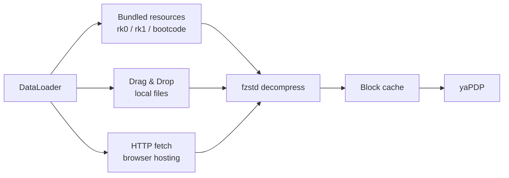

# yaPDP — Yet Another PDP‑11/70 Web Emulator, with Authentic Front Panel & Model 33 ASR Teletype


---

## Foreword: A Personal Note

I first saw DEC minicomputers as a child, and later worked hands‑on with their Soviet clones — the **SM‑4** and **SM‑1420** running **RSX‑11M**. Decades later, thanks to the incredible work of Paul Nankervis, it is possible to boot Unix V5, BSD 2.11, Ultrix‑11, RSX‑11M, RSTS/E and RT‑11 in a browser.

This repository is the result: **yaPDP**. Welcome to the machine.

---

## About This Project

This is **yaPDP**, a **PDP‑11/70** emulator written entirely in JavaScript. It runs in any modern browser — no plugins, no downloads, no configuration. Just run the emulator and you're standing in front of a DEC minicomputer.

### What makes it special

| Feature | Description |
|---------|-------------|
| **Authentic Front Panel** | Every switch, LED, and rotary knob faithfully recreated. Toggle in a bootstrap loader the way DEC engineers did in the 1970s. |
| **Model 33 ASR Teletype** | A fully animated Google60-style teletype connected as the operator console — complete with paper printing, keypunch sounds, line-feed whirs, and authentic nroff/man overstrike (^H) rendering: re-printing the same glyph gives bold, underscores give underline, and striking a *different* glyph (e.g. a 2.11 BSD boot countdown) leaves the real dark overstrike blot a hard-copy terminal makes. Long lines faithfully jam the carriage at the right margin (72 or 80 columns; characters overstrike the last column instead of wrapping, no scrollbar), and the paper width follows the selected width so a full line reaches the paper edge. The console echo speed is selectable in the CONFIG page: **authentic 110 baud (~10 chars/sec)** or a fast development pace (~33 chars/sec). |
| **VT52 Terminal** | A DECscope VT52 terminal (TT1:) rendered on canvas with its authentic white/grey (P4) phosphor on a black tube — an optional reverse-video mode swaps it to black text on white — for guest OSes that prefer video terminals. Clear screen (ESC E) and form feed (^L) both wipe the display and home the cursor, so `clear` and multi-page nroff/man output start each page from the top row. An optional pure-CSS CRT simulation adds brightness flicker, scanline shimmer and a vertical-hold roll band. |
| **VT11 Display** | An optional DEC VT11 vector-graphics display processor on its own green-phosphor CRT page (1024x768 logical resolution, auto-scaled to fit the window), enabled from the CONFIG page. |
| **16 Guest Operating Systems** | Boot Unix V5, 2.11 BSD, Ultrix‑11, RSX‑11M (3.2 & 4.6), RSTS/E (4B‑17 through 10.1), RT‑11, XXDP diagnostics, and more. |
| **Persistent Disk Images** | All disk and tape images are preloaded. Changes to disk contents persist in browser storage across sessions. |
| **Paper Tape Reader** | Load BASIC‑11, ODT‑11, ED‑11, or Lunar Lander from simulated paper tape. |

### Live Demo

- [**yaPDP**](https://paulnank.github.io/pdp11-js/pdp11.html)

The repository root also contains [`index.html`](index.html) — a landing page in the
same DEC style as the emulator itself, telling the story behind the project and
linking to the live demo, the source code and the original authors.

---

## Desktop App (Tauri)

The same emulator is packaged as a native desktop application with [Tauri v2](https://tauri.app/).
It runs fully offline. Two installer variants are published, so users can pick between a tiny
download and a fully-offline bundle with every disk/tape image:

| Variant | Ships | Notes |
|---------|-------|-------|
| **Minimal** | `rk0`, `rk1`, `bootcode` | Small download (~3 MB). All other images are **dragged & dropped** at runtime. |
| **Full** | every image — RK/RL/RP/RA disks, TM tapes, all paper tapes | Larger download, but all 16 guest OSes boot offline with zero extra steps. |

### Artifacts (Windows x64)

| Artifact | Size |
|----------|------|
| `yaPDP-Minimal_0.1.0_x64-setup.exe` (NSIS) / `.msi` (WiX) / `yaPDP-Minimal.exe` | ~3.2 MB / ~4.3 MB / ~6.2 MB |
| `yaPDP-Full_0.1.0_x64-setup.exe` (NSIS) / `.msi` (WiX) / `yaPDP-Full.exe` | ~84 MB / ~85 MB / ~6.2 MB |

### Bundled images

The **Minimal** build bundles:

| Image | OS | How to Boot |
|-------|----|-------------|
| `rk0.dsk` | Unix V5 | `boot rk0` → `unix` → login `root` |
| `rk1.dsk` | RT‑11 v4.0 | `boot rk1` |
| `bootcode.ptap` | Bootstrap loader | loaded via Paper Tape reader |

The **Full** build additionally bundles all `rk2`–`rk5`, `rl0`–`rl3`, `rp0`–`rp4`, `ra0`–`ra2`,
`tm0`–`tm2` and the remaining paper tapes (`DEC-11-AJPB-PB`, `DEC-11-O2PA-PB`, `ED-11-V004B-8K`,
`lander`) — see the [guest OS table](#guest-operating-systems) for how to boot each one.

In either build, any image not shipped can be loaded at runtime by **dragging the file** onto the
drop zone in the control bar — `.dsk`, `.tap`, `.ptap` and their `.zst`-compressed forms are
supported. Mounted images persist in IndexedDB and are re-mounted automatically on the next launch.

### How image loading works



On a static host, disk/tape images are fetched from the `media/` directory
**relative to the emulator page** (`fetch("media/…")`), not from `../media/`.
Keeping the path page-relative is what lets the emulator run when the repository
is served from a subpath — e.g. GitVerse Pages publishes it under `/yapdp/`,
where `../media` would resolve one level too high and hit the SPA fallback page
instead of the real binary file.

### When an image cannot be loaded

If a guest OS image cannot be fetched completely — a big BSD image dropped by
the hosting server mid-download, or an image that is not bundled in the
**Minimal** desktop build — the emulator doesn't stall silently. A dialog in
the same shared modal style as the first-run hint explains that the image is
incomplete and offers **Open Storage**, which jumps straight to the Drop zone
for a manual drag & drop of the downloaded file. Detection covers truncated
HTTP responses (a `Content-Length` mismatch or an empty body) and corrupted or
partial `.zst` data that `fzstd` cannot decompress.

The wording adapts to the environment: a page opened as a local `file://`
explains that the browser blocks fetching the media directory (and suggests a
local web server), while the Tauri **Minimal** build explains that the image is
not shipped and points to the Drop zone.

### Quick boot (magic wand)

A magic-wand button pinned to the top-right corner of the **Panel** page opens
a picker for every guest OS. Choosing one switches to the operator console,
reboots the machine and types `boot <dev>` — and where the credentials are
known, the login too (e.g. Unix V5: `boot rk0` → `unix` → `root`). The boot
sequences live in [`src/osboot.js`](src/osboot.js) (a hand-curated
machine-readable config, so the picker never has to parse the free-text Info
table); the flow itself is implemented in [`src/quickboot.js`](src/quickboot.js)
and feeds the console through the same input queue the physical keyboard uses.

Login steps are prompt-aware: instead of firing on a timer, the wizard watches
the console output and types only when the guest prints `login:` (with a
timeout fallback), so slow boots with lots of output (e.g. 2.11 BSD) still
reach the login prompt reliably.

Each OS also declares the machine profile it wants (`hardware` in
`src/osboot.js`): e.g. Unix V5 / BSD / RT-11 / ULTRIX force a teletype
console, and RT-11 / RSX / RSTS enable the LP11 line printer. If the current
configuration differs, the wizard applies the profile (like the CONFIG Apply
button), reloads, and resumes the boot automatically.

Paper tapes (BASIC-11, ODT-11, ED-11, Lunar Lander) live in the same picker:
the wizard selects the tape in the Storage `#ptr` select and boots it via
`boot pr`. Lunar Lander additionally enables the VT11 vector display and
switches to the **Display** page so the landing module is visible.

Each wizard boot starts "on a fresh page": the teletype and LP11 paper and the
VT52 screens are cleared before the machine reboots, so the boot banner lands
on clean output. While the sequence is being typed a small toast warns
"Autoloading in progress — don't touch the teletype/keyboard"; it disappears
when the boot finishes, as soon as the operator presses any key, or the moment
an image fails to load (the wizard stops typing and the "Image load
interrupted" dialog takes over).

### Installing the toolchain (Windows)

Building the desktop app on a fresh Windows machine requires the following
components:

1. **Node.js ≥ 18** — download the LTS release from <https://nodejs.org>, or
   `winget install OpenJS.NodeJS.LTS`.
2. **Rust (MSVC toolchain)** — install via <https://rustup.rs>
   (or `winget install Rustlang.Rustup`); the default host target
   `stable-x86_64-pc-windows-msvc` is exactly what this project needs.
3. **Microsoft C++ Build Tools / Visual Studio 2019 or 2022** with the
   **"Desktop development with C++"** workload — both the Rust MSVC linker and
   the Tauri CLI require it. The Community edition is free and sufficient.
4. **WebView2 Runtime** — built into Windows 11; on Windows 10 install the
   Evergreen Runtime from the
   [Microsoft WebView2](https://developer.microsoft.com/microsoft-edge/webview2/)
   page.
5. **Tauri CLI v2** — `cargo install tauri-cli --version "^2"`.

Verify every component is on the `PATH` before building:

```bash
node --version    # >= 18
cargo --version   # stable MSVC toolchain
cargo tauri --version
```

The Tauri bundler downloads the WiX and NSIS tools automatically on the first
build, so no extra setup is needed to produce the `.msi` and `.exe` installers.
Then stage and build either variant:

```bash
npm run desktop:minimal   # yaPDP-Minimal: rk0/rk1/bootcode
npm run desktop:full      # yaPDP-Full: every disk/tape image
```

### Building the desktop app

Once the [toolchain above](#installing-the-toolchain-windows) is installed, the
build is orchestrated through npm scripts — the repo has no npm dependencies,
just plain Node tooling. Run `npm run` to list every target:

| Script | Action |
|--------|--------|
| `npm run stage` | Stage the lightweight frontend (excludes heavy `media/`) into `desktop/`; default variant is `minimal` |
| `npm run desktop` / `desktop:minimal` | Stage + build installers (MSI + NSIS + portable exe), `minimal` variant (rk0/rk1/bootcode) |
| `npm run desktop:full` | Stage + build installers with every disk/tape image bundled |
| `npm test` | Run the modular tests (Config + DataLoader + onboarding + image-load error + quick-boot scenarios + VT52 overstrike + LP11 text + G60Printer paper geometry/flush + DL11 console receive + VT11 display + fullscreen toggle + machine hum) |
| `npm run serve` | Local static server on port 1170 (HTTP Range supported) for browser development |
| `npm run clean` | Remove `desktop/` and the generated `tauri.conf.json` |

```bash
# Build the full desktop app (stage + installers) in one step
npm run desktop:full

# Or manually: stage only
npm run stage -- --variant full

# Serve the browser version for development
npm run serve
```

`tools/build-desktop.js` (invoked by the `stage`/`desktop*` scripts) copies the matching
`src-tauri/tauri.conf.<variant>.json` over `src-tauri/tauri.conf.json` (gitignored) so
`cargo tauri build` picks up the right set of bundled resources. Re-run the staging step
after any web-source change before rebuilding.

The installers are branded with a themed PDP-11 front-panel artwork (dark cabinet,
"11" lettering, indicator lamps, toggle switches) that ships as static
`src-tauri/installer/*.bmp`:

| Image         | Size    | Used by                                                     |
|---------------|---------|-------------------------------------------------------------|
| `sidebar.bmp` | 164x314 | NSIS — left sidebar of the Welcome/Finish pages             |
| `banner.bmp`  | 493x58  | MSI (WiX) — banner strip on every wizard page               |
| `dialog.bmp`  | 493x312 | MSI (WiX) — Welcome/Finish dialog body                      |

All three are BMP because NSIS Modern UI 2 and the WiX UI extension require that
format. They are wired in via `bundle.windows.nsis.sidebarImage` and
`bundle.windows.wix.bannerPath` / `bundle.windows.wix.dialogImagePath` in
`src-tauri/tauri.conf.minimal.json` / `src-tauri/tauri.conf.full.json`.

---

## Guest Operating Systems

The emulator ships with ready-to-boot disk and tape images. Just type `boot <device>` at the `Boot>` prompt.

| Disk | Operating System | How to Boot |
|------|-----------------|-------------|
| **RK0** | Unix V5 | `boot rk0` → `unix` → login as `root` |
| **RK1** | RT‑11 v4.0 | `boot rk1` |
| **RK2** | RSTS V06C‑03 | `boot rk2` — login `11,70` password `PDP` |
| **RK3** | XXDP (diagnostics) | `boot rk3` |
| **RK4** | RT‑11 3B Distribution | `boot rk4` |
| **TM0** | RSTS 4B‑17 (tape) | `boot tm0` — follow ROLLIN restore procedure |
| **RL0** | BSD 2.9 | `boot rl0` → `rl(0,0)rlunix` → CTRL/D → login `root` |
| **RL1** | RSX‑11M v3.2 | `boot rl1` — login `1,2` password `SYSTEM` |
| **RL2** | RSTS/E v7.0 | `boot rl2` — login `11,70` password `PDP` |
| **RL3** | XXDP (extended) | `boot rl3` |
| **RP0** | ULTRIX‑11 V3.1 | `boot rp0` → CTRL/D → login `root` |
| **RP1** | BSD 2.11 | `boot rp1` — autoboots to multiuser, login `root` |
| **RP2** | RSTS/E v9.6 | `boot rp2` — answer prompts, login `11,70` |
| **RP3** | RSX‑11M v4.6 | `boot rp3` — auto-logs `1,2` SYSTEM |
| **RP4** | RSTS/E v10.1 | `boot rp4` — answer prompts, login `11,70` |

> Full boot session logs for every OS can be found in [`docs/ExampleBoots.md`](docs/ExampleBoots.md).

---

## Quick Start

1. Open the [yaPDP emulator](https://paulnank.github.io/pdp11-js/pdp11.html).
2. At the `Boot>` prompt, type `boot rp1` and press ENTER.
3. BSD 2.11 will autoboot into multiuser mode. Login as `root` (no password).
4. Try `ls`, `ps -aux`, `df` — or compile a C program with `cc`.

### Switching pages

Use the sidebar to switch between:
- **Panel** — the front panel with switches and LEDs
- **Console** — the operator console: a Model 33 ASR teletype (when the console terminal is a teletype)
- **Console** — the operator console: a DECscope VT52 (when the console terminal is a VT52)
- **TTY 1 / TTY 2** — user VT52 terminals, shown only when configured
- **Printer** — the LP11 line printer page, shown only when configured
- **Display** — the VT11 vector-graphics CRT page, shown only when configured
- **Storage** — storage media: paper-tape reader, disk/tape image import and mounted images
- **Config** — configure the emulated peripherals (persisted between sessions)
- **Info** — detailed instructions and OS reference

A floating **fullscreen** button (bottom-right of the window) hides the browser/
system chrome — the address bar in the browser, the OS window frame and the
taskbar in the Tauri desktop app — while leaving the emulator UI untouched.
Press it again (or Esc) to return.

The **Config** page controls the console terminal type (teletype or VT52), the
number of user terminals (0–2), the presence of the LP11 line printer and the
VT11 graphics display, the teletype print width (72/80 — a Model 33 ASR is at
most 80 columns), the printer print width (72/80/100/132), optional VT100-style
key-click sound for VT52 terminals, the historical VT52 reverse-video mode
(black text on white), a pure-CSS CRT simulation (brightness flicker, scanline
shimmer and a vertical-hold roll band), the ambient PDP-11 power-supply hum and
fan noise while the machine is on, and the PDP-11 machine-room photo backdrop
behind the pages. The LP11 line printer defaults to the authentic 132-column
width.
The form is split into three tabs — **Equipment** (console terminal, user
terminals, LP11 printer, VT11 display, print widths and teletype speed),
**Visual enhancements** (key click, reverse video, CRT effects, machine hum,
photo backdrop) and **Behaviour** (reboot confirmation) — with the
**Apply** and **Restore defaults** actions in a bar below the tabs.
Structural changes (console type, terminals, printer, VT11 display) are
committed with the **Apply** button, which restarts the machine so the emulated
hardware matches the configuration; print widths, the teletype speed, the key
click, the reverse video, the CRT effects, the machine hum and the photo
backdrop apply immediately. A **Restore defaults** button fills the form with
factory values (committed by **Apply**).
The hum is synthesized with Web Audio on its own audio channel, so it never
cuts off the teletype/printer or the VT52 key-click sounds.

The **Storage** page manages the storage media: the paper-tape reader file
selector, the drag & drop disk/tape image drop zone and the
mounted-images/Unmount list. Images dropped there are mounted into DataLoader
and persist in IndexedDB across sessions.

The **REBOOT** button is pinned to the top-right corner of the window
(mirroring the fullscreen toggle in the bottom-right corner). Pressing it
restarts the machine and boots the built-in default loader; by default a
confirmation dialog asks first, with a "Don't show this warning anymore"
option. The warning can be restored at any time from the Config page's
**Behaviour** tab.

The **Printer** page renders the LP11 output on an animated paper machine (no
keyboard) and offers **Print** (send the accumulated jobs to the real OS printer
via the system dialog) and **Save .txt** buttons. Like the real LP11, it echoes
characters far faster than the Model 33 ASR console teletype (the console keeps its
authentic ~33 cps pacing) and prints on a wide 132-column paper at close to the
original's ~300 lines/min. Both the teletype and the printer size their paper
to the configured print width (centred in the machine body), so a full line
always reaches the paper edge. Both also advance the carriage to the next
8-column tab stop on TAB, matching real Model 33 ASR / LP11 behaviour.

Both also honour form feed (FF, 0x0C): the 2.11BSD spooler (`lpr`/`lpd`) sends
FF between print jobs so each starts on a fresh page. The LP11 ejects to the
top of the next fanfold page — it fills the rest of the sheet (66 lines at
6 LPI for an 11″ page) and closes it with a dashed fold/perforation marker;
the Model 33 ASR console teletype (which also supported FF via its FORM key) simply
advances its smooth paper roll. The **Save .txt** export keeps a `\f` marker so
the real page breaks survive in the file.

### A simple light chaser

Toggle this into the front panel to see the address and data LEDs dance:

```
Switch sequence: HALT, 001000, LOAD ADDRESS
                 012700, DEPOSIT
                 000001, DEPOSIT
                 006100, DEPOSIT
                 000005, DEPOSIT
                 000775, DEPOSIT
                 001000, LOAD ADDRESS, ENABLE, START
```

### Restart the bootloader

```
HALT, 120000, LOAD ADDRESS, ENABLE, START
```

---

## Project Architecture

| File | Purpose |
|------|---------|
| [`src/pdp11.js`](src/pdp11.js) | Core CPU emulation (PDP‑11/70 instruction set, MMU, interrupts) |
| [`src/fpp.js`](src/fpp.js) | Floating‑Point Processor (FP11) emulation |
| [`src/iopage.js`](src/iopage.js) | I/O page — disk controllers, terminal interfaces, paper tape reader, line printer |
| [`src/pdp11-panel.js`](src/pdp11-panel.js) | Front panel rendering and switch interaction |
| [`src/pdp11-app.js`](src/pdp11-app.js) | Application glue — boots the emulator, wires the configured teletype/VT52 console, user terminals, printer and the CONFIG page |
| [`src/config.js`](src/config.js) | User configuration (CONFIG page) — validated, persisted in localStorage |
| [`src/hum.js`](src/hum.js) | Ambient PDP-11 power-supply hum + fan noise — synthesized on a dedicated Web Audio context, follows power/run state |
| [`src/vt52.js`](src/vt52.js) | DECscope VT52 terminal emulation (canvas‑based); renders nroff/man overstrike as bold/underline |
| [`src/g60printer.js`](src/g60printer.js) | Google60-style teletype printer (Model 33 ASR / LP11) |
| [`src/vt11.js`](src/vt11.js) | Vector graphics VT11 display |
| [`src/bootcode.js`](src/bootcode.js) | The custom bootstrap loader program |
| [`src/dragdrop.js`](src/dragdrop.js) | Drag & drop disk/tape image import — mounts files into DataLoader, persists them in IndexedDB |
| [`src/tauri-bundled.js`](src/tauri-bundled.js) | Tauri desktop: loads the bundled boot images via the Rust `load_bundled_image` command |
| [`src/imgerror.js`](src/imgerror.js) | Shared modal dialog shown when a disk/tape image fails to load (dropped connection, truncated or corrupt `.zst`) — explains the failure and links to the Storage page |
| [`src/osboot.js`](src/osboot.js) | Guest OS boot scenarios for the quick-boot wizard — hand-curated `boot` commands and auto-login steps per device |
| [`src/quickboot.js`](src/quickboot.js) | Quick-boot magic-wand button on the Panel page — OS picker dialog, reboot + typed boot/login sequence via the console input queue |
| [`src/fullscreen.js`](src/fullscreen.js) | Floating fullscreen toggle — browser Fullscreen API in the web build, native window fullscreen in the Tauri app |
| [`tests/config.test.js`](tests/config.test.js) | Config validation/persistence modular tests — run with `node tests/config.test.js` |
| [`tests/dataloader.test.js`](tests/dataloader.test.js) | DataLoader/`fetchBlock` modular tests — run with `node tests/dataloader.test.js` |
| [`tests/vt52.test.js`](tests/vt52.test.js) | VT52 overstrike (bold/underline) modular tests — run with `node tests/vt52.test.js` |
| [`tests/g60printer-flush.test.js`](tests/g60printer-flush.test.js) | G60Printer `flushCharBuffer()` backlog-flush modular tests — run with `node tests/g60printer-flush.test.js` |
| [`tests/dl11-recv.test.js`](tests/dl11-recv.test.js) | DL11 console receive-path modular tests (^C delivery, RBUF/DONE, vector 60 interrupt) — run with `node tests/dl11-recv.test.js` |
| [`tests/vt11.test.js`](tests/vt11.test.js) | VT11 display register/gating modular tests — run with `node tests/vt11.test.js` |
| [`tests/fullscreen.test.js`](tests/fullscreen.test.js) | Fullscreen toggle runtime-detection modular tests — run with `node tests/fullscreen.test.js` |
| [`tests/hum.test.js`](tests/hum.test.js) | Machine-hum state-to-gain mapping modular tests — run with `node tests/hum.test.js` |
| [`tests/imgerror.test.js`](tests/imgerror.test.js) | ImageError `messageFor()` modular tests (network/truncated/decompress wording) — run with `node tests/imgerror.test.js` |
| [`tests/osboot.test.js`](tests/osboot.test.js) | OSBoot scenarios + QuickBoot pure-helper modular tests (bytes, console page, step delay, mounted filter) — run with `node tests/osboot.test.js` |
| [`css/pdp11.css`](css/pdp11.css) | Front panel and application styles |
| [`css/g60printer.css`](css/g60printer.css) | Teletype printer styles |
| [`tools/build-desktop.js`](tools/build-desktop.js) | Stages the lightweight Tauri frontend into `desktop/`; `--variant minimal\|full` selects which bundled media images to ship |
| [`tools/serve.js`](tools/serve.js) | Minimal static file server for the browser emulator (port 1170, HTTP Range support) |
| [`package.json`](package.json) | npm build scripts — `test`, `stage`, `desktop`/`desktop:minimal`/`desktop:full`, `serve`, `clean` |
| [`src-tauri/`](src-tauri/) | Tauri v2 desktop shell — Rust commands, `tauri.conf.minimal.json` / `tauri.conf.full.json`, bundled resources, app icons |
| [`assets/vendor/fzstd.js`](assets/vendor/fzstd.js) | Bundled fzstd (ZSTD decompression) — served locally instead of an external CDN so disk/tape images decompress reliably on any network |

### Media files

Disk (`.dsk`), tape (`.tap`), and paper tape (`.ptap`) images live in the [`media/`](media/) directory. Many are ZST‑compressed to stay within GitHub size limits. Disk and tape images ship as `.zst` and are fetched and decompressed in the browser via the bundled fzstd library (no raw `.dsk`/`.tap` copy is required). See [`media/README.md`](media/README.md) for the naming convention.

---

## License

This project is released under the [MIT License](LICENSE).

Copyright (c) 2026 Alexei Eskenazi

---

## Acknowledgments

This project stands on the shoulders of giants.

### Paul Nankervis — Original PDP‑11 Emulator

Paul wrote the original [pdp11-js](https://github.com/paulnank/pdp11-js) emulator, which this repository is forked from. His meticulous work — cycle‑accurate CPU emulation, beautifully rendered front panels, and a meticulously curated collection of vintage operating systems — made this project possible. His story about chasing the RSTS/E console light pattern is legendary among DEC enthusiasts.

> *"I met my core objective — I can now see the RSTS/E console light pattern that I was looking for."*
> — Paul Nankervis

### Norbert Landsteiner (mass:werk) — Google60 Teletype

The Model 33 ASR teletype emulation is adapted from [**Google60**](https://www.masswerk.at/google60/) by **Norbert Landsteiner** of [mass:werk](https://www.masswerk.at/). Google60 is a brilliant simulation of the Google search interface as it would have appeared on a Model 33 ASR Teletype in the 1960s/1970s. Norbert's meticulous implementation — from the 3D keycaps to the paper advance animation and authentic sound effects — brings the teletype to life. This project repurposes his engine as the operator console for the PDP‑11.

His work is a masterclass in retro‑UI simulation. Thank you, Norbert.

### Additional Sources

- [**Bitsavers**](http://bitsavers.org/pdf/dec/pdp11/) — DEC PDP‑11 documentation archive
- [**Bitsavers Software**](http://bitsavers.org/bits/DEC/pdp11/) — PDP‑11 software and disk images
- [**The Unix Heritage Society (TUHS)**](https://www.tuhs.org/) — Preserving UNIX history
- [**RSTS.ORG**](http://www.rsts.org/) — RSTS/E community and software preservation

---

## Links

| Resource | URL |
|----------|-----|
| Original pdp11-js | <https://github.com/paulnank/pdp11-js/> |
| Google60 (mass:werk) | <https://www.masswerk.at/google60/> |
| mass:werk | <https://www.masswerk.at/> |
| Bitsavers (docs) | <http://bitsavers.org/pdf/dec/pdp11/> |
| Bitsavers (software) | <http://bitsavers.org/bits/DEC/pdp11/> |
| TUHS | <https://www.tuhs.org/> |

---

*Happy emulating!*

— Paul Nankervis (*original author*)  
— *Fork maintained with love for the DEC era*
