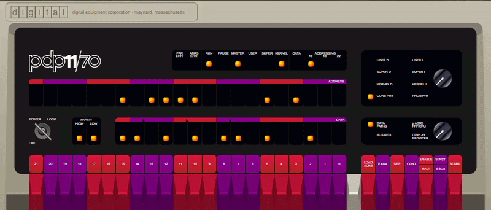
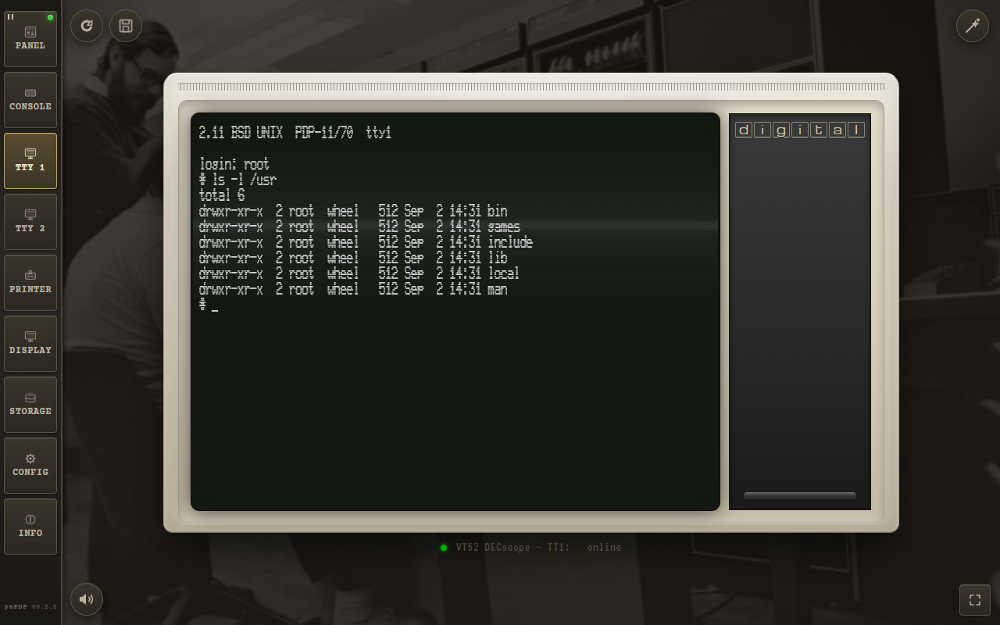
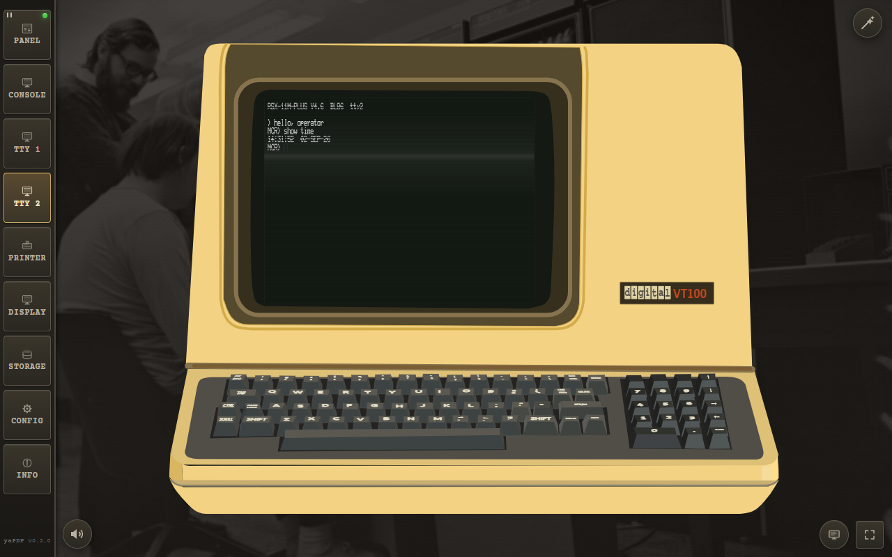
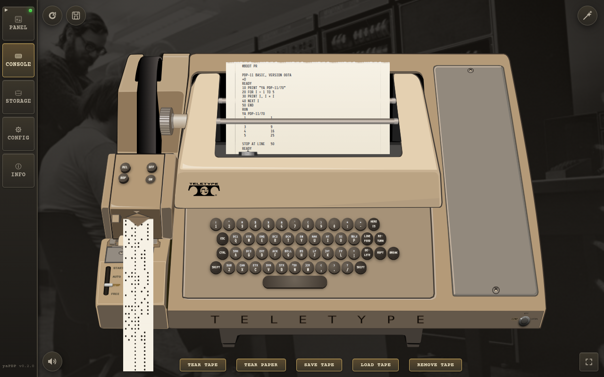

# yaPDP — Yet Another PDP‑11/70 Web Emulator with an Authentic Front Panel & Model 33 ASR Teletype

> **An immersive PDP-11 in the browser.** Features an authentic working front panel, Teletype Model 33 ASR, paper tapes, crisp VT52/VT100 terminals, VT11 vector display, and a clattering LP11 line printer. Built to bring back the machine room.

---

## Live Experience

  

  <b>▸ <a href="https://amesk.github.io/yaPDP/pdp11.html">Launch the live PDP-11/70 emulator directly in your browser</a> ◂</b>
   
  <a href="https://amesk.github.io/yaPDP/">Project site</a> · <a href="https://github.com/amesk/yaPDP">Source on GitHub</a> · Desktop builds for Windows & Linux

---

## Foreword: A Personal Note

I first saw DEC minicomputers as a child, and later worked hands‑on with their Soviet clones — the **SM‑4** and **SM‑1420** running **RSX‑11M**. Decades later, thanks to the incredible work of Paul Nankervis, it is possible to boot Unix V5, BSD 2.11, Ultrix‑11, RSX‑11M, RSTS/E and RT‑11 directly in a web browser.

This repository is the result: **yaPDP**. Welcome to the machine.

---

## Key Features & The Machine Room Experience

**yaPDP** runs in any modern browser with zero plugins, zero downloads, and zero server requirements.

* **Authentic Front Panel:** Every switch, LED, and rotary knob faithfully recreated. Toggle in a bootstrap loader or run light-chaser routines the way DEC engineers did in the 1970s.
* **Model 33 ASR Teletype:** The operator console features a fully animated, authentic Model 33 ASR — featuring 3D keycaps, paper printing with true `nroff`/`man` overstrike, carriage margin jamming, and an 8-track paper-tape reader/punch unit with real START/STOP/FREE/AUTO switches.
* **Clattering LP11 Line Printer:** Beige/grey cabinet, fanfold paper, ON LINE lamp, ~300 lines/min, DONE handshake, sticky ERROR latching, and realistic soundscapes. Print directly to a physical printer or export as `.txt`.
* **Crisp Vector Terminals:** High-definition DECscope **VT52** (canvas tube with P4 phosphor, reverse video, CRT simulation) and **VT100** (P4 white / P1 green phosphor, VT100 key clicks, SGR attribute rendering, native clipboard integration).
* **VT11 Graphics Display Processor:** Optional vector-graphics display page running on its own green-phosphor CRT — includes the classic *Lunar Lander*.
* **Guest Operating Systems & Quick Boot:** Single-click magic wand boots any guest OS from the preloaded images — Unix V5, BSD 2.9 & 2.11, ULTRIX‑11, RSX‑11M (3.2 & 4.6), RSTS/E (4B‑17 through 10.1), RT‑11 and XXDP diagnostics — applying the machine profile and typing the boot command, prompt-aware.
* **Persistent Browser Storage:** Disk and tape changes persist across sessions using local browser storage.
* **Touch & Mobile Optimized:** Responsive layout with custom on-screen keyboards for VT52/VT100/Model 33, special-key bars (`CTRL`, `ESC`, `TAB`, `RUBOUT`, control codes), and two-finger pan/zoom for small devices.

---

## Hardware & Guest OS Gallery

<table>
  <tr>
    <td align="center" width="50%">
      
       
      <b>DEC VT52 Video Terminal</b>
    </td>
    <td align="center" width="50%">
      
       
      <b>DEC VT100 Video Terminal</b>
    </td>
  </tr>
  <tr>
    <td align="center" colspan="2">
      
       
      <b>Running BASIC-11 on the PDP-11</b>
    </td>
  </tr>
</table>

---

## Guest Operating Systems

The emulator ships with preloaded disk and tape images. To manual boot, type the boot command at the `@` prompt:

| Disk | Operating System | How to Boot |
|------|-----------------|-------------|
| **RK0** | Unix V5 | `boot rk0` → `unix` → login as `root` |
| **RK1** | RT‑11 v4.0 | `BOOT RK1` |
| **RK2** | RSTS V06C‑03 | `BOOT RK2` — login `11,70` password `PDP` |
| **RK3** | XXDP (diagnostics) | `BOOT RK3` |
| **RK4** | RT‑11 3B Distribution | `BOOT RK4` |
| **TM0** | RSTS 4B‑17 (tape) | `BOOT TM0` — follow ROLLIN restore procedure |
| **RL0** | BSD 2.9 | `boot rl0` → `rl(0,0)rlunix` → CTRL/D → login `root` |
| **RL1** | RSX‑11M v3.2 | `BOOT RL1` — login `1,2` password `SYSTEM` |
| **RL2** | RSTS/E v7.0 | `BOOT RL2` — login `11,70` password `PDP` |
| **RL3** | XXDP (extended) | `BOOT RL3` |
| **RP0** | ULTRIX‑11 V3.1 | `boot rp0` → CTRL/D → login `root` |
| **RP1** | BSD 2.11 | `boot rp1` — autoboots to multiuser, login `root` |
| **RP2** | RSTS/E v9.6 | `BOOT RP2` — answer prompts, login `11,70` |
| **RP3** | RSX‑11M v4.6 | `BOOT RP3` — auto-logs `1,2` SYSTEM |
| **RP4** | RSTS/E v10.1 | `BOOT RP4` — answer prompts, login `11,70` |

> Full boot session logs for every OS are available in [`docs/ExampleBoots.md`](docs/ExampleBoots.md).

---

## Desktop Application (Tauri v2)

For offline execution, **yaPDP** is packaged as a cross-platform desktop application using [Tauri v2](https://tauri.app/).

* **Minimal Installer (~19 MB):** Ships core media (`rk0` Unix V5, `rk1` RT-11, `bootcode`, BASIC-11, ODT-11, ED-11, Lunar Lander). Additional disk images can be drag-and-dropped at runtime.
* **Full Installer (~103 MB):** Pre-packaged with every disk and tape image, so the whole guest‑OS line‑up boots completely offline. Most of that download is the application itself (artwork, audio, fonts), not the images.
* **Supported Platforms:** Windows x64 (MSI / NSIS / Portable) and Linux x64 (deb / rpm / AppImage).

For build instructions and toolchain configuration, see [`docs/BUILDING.md`](docs/BUILDING.md) and [`docs/RELEASING.md`](docs/RELEASING.md).

---

## Quick Start & Documentation

1. Open the [yaPDP Live Emulator](https://amesk.github.io/yaPDP/pdp11.html).
2. At the `@` prompt, type `boot rp1` and press **ENTER**.
3. BSD 2.11 will autoboot into multiuser mode. Log in as `root` (no password).
4. Run standard UNIX commands (`ls`, `ps -aux`, `df`) or compile C programs with `cc`.

### Manual & Feature Walkthroughs
* **User Manual:** Step-by-step user guide with DEC-styled layout and live screenshots: [`manual.html`](https://amesk.github.io/yaPDP/manual.html).
* **Feature Deep-Dive:** Walkthrough of hardware pages, panel tricks, and peripheral controls: [`docs/FEATURES.md`](docs/FEATURES.md).
* **Known Issues:** Bugs and their workarounds, honestly listed: [`docs/known-issues.md`](docs/known-issues.md).
* **Roadmap:** Where the machine is heading next: [`docs/ROADMAP.md`](docs/ROADMAP.md).

---

## Project Architecture & Technical Highlights

Building **yaPDP** involved implementing low-level computer architecture and real-time hardware emulation in JavaScript:

* **CPU Core (`src/pdp11.js`):** Cycle-accurate 16-bit PDP-11 CPU instruction decoder, registers, and trap logic.
* **Memory & Memory-Mapped I/O (`src/iopage.js`):** Interconnects CPU execution with virtual hardware peripheral registers.
* **Application & State Glue (`src/pdp11-app.js`, `src/config.js`):** Connects the emulation engine to browser DOM elements, sound players, and state synchronization.
* **Bootstrap Loader & OS Wizard (`src/bootcode.js`, `src/osboot.js`, `src/quickboot.js`):** Bootloader injection logic and prompt-aware automated OS startup scripts.
* **Automation & Video Pipeline:** Automated screenshot generation via [`tools/screenshots-manual.js`](tools/screenshots-manual.js) and headless promo video assembly via [`tools/record-video.js`](tools/record-video.js) / [`tools/assemble-video.js`](tools/assemble-video.js).

Full directory structure and module descriptions are detailed in [`docs/ARCHITECTURE.md`](docs/ARCHITECTURE.md); the Unibus machine layer has its own deep dive in [`docs/machine-layer.md`](docs/machine-layer.md) and the XXDP diagnostics in [`docs/xxdp-diagnostics.md`](docs/xxdp-diagnostics.md).

---

## Acknowledgments

This project stands on the shoulders of giants:

* **Paul Nankervis — Original PDP-11 Emulator:** Author of the original [pdp11-js](https://github.com/paulnank/pdp11-js) engine. His cycle-accurate CPU emulation and curated OS collections made this project possible.
  > *"I met my core objective — I can now see the RSTS/E console light pattern that I was looking for."* — Paul Nankervis
* **Norbert Landsteiner (mass:werk) — Google60 Teletype:** The Model 33 ASR teletype visual engine and audio simulation are adapted from [Google60](https://www.masswerk.at/google60/).
* **Digital Equipment Corporation (DEC):** For creating the legendary PDP-11 architecture.
* **Archives & Preservation Communities:** [Bitsavers](http://bitsavers.org/pdf/dec/pdp11/), [The Unix Heritage Society (TUHS)](https://www.tuhs.org/), and [RSTS.ORG](http://www.rsts.org/).

---

## License & Resource Links

This project is licensed under the **[MIT License](LICENSE)**.
*Copyright (c) 2026 Alexei Eskenazi*

| Resource | Link |
|----------|------|
| **Original pdp11-js** | [github.com/paulnank/pdp11-js](https://github.com/paulnank/pdp11-js/) |
| **Google60 (mass:werk)** | [mass.werk.at/google60](https://www.masswerk.at/google60/) |
| **Bitsavers Documentation** | [bitsavers.org/pdf/dec/pdp11](http://bitsavers.org/pdf/dec/pdp11/) |
| **TUHS Archives** | [tuhs.org](https://www.tuhs.org/) |
