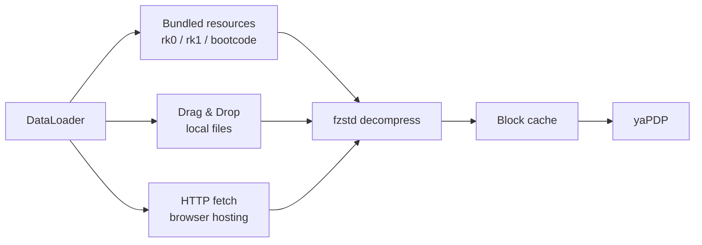

# Building yaPDP

This document covers the Tauri desktop app: variants, artifacts, bundled
images, image-loading internals, toolchain installation and the build
commands. The browser version needs no build at all — serve the repository
root with any static server (`npm run serve` for a local one on port 1170).

## Desktop App (Tauri)

The same emulator is packaged as a native desktop application with [Tauri v2](https://tauri.app/).
It runs fully offline. Two installer variants are published, so users can pick between a tiny
download and a fully-offline bundle with every disk/tape image:

| Variant | Ships | Notes |
|---------|-------|-------|
| **Minimal** | `rk0`, `rk1`, `bootcode` | Small download (~3 MB). All other images are **dragged & dropped** at runtime. |
| **Full** | every image — RK/RL/RP/RA disks, TM tapes, all paper tapes | Larger download, but all 16 guest OSes boot offline with zero extra steps. |

### Artifacts (Windows x64)

| Artifact | Size |
|----------|------|
| `yaPDP-Minimal_0.1.0_x64-setup.exe` (NSIS) / `.msi` (WiX) / `yaPDP-Minimal.exe` | ~3.2 MB / ~4.3 MB / ~6.2 MB |
| `yaPDP-Full_0.1.0_x64-setup.exe` (NSIS) / `.msi` (WiX) / `yaPDP-Full.exe` | ~84 MB / ~85 MB / ~6.2 MB |

### Artifacts (Linux x64)

Built on Linux (no cross-compilation — see below). `.deb` for Debian/Ubuntu
family, `.rpm` for Fedora/RHEL/openSUSE, `.AppImage` is a self-contained
download-and-run format (no installation):

| Artifact | Size |
|----------|------|
| `yaPDP-Minimal_0.1.0_amd64.deb` / `.rpm` / `.AppImage` | ~13.5 MB / ~13.5 MB / ~88 MB |
| `yaPDP-Full_0.1.0_amd64.deb` / `.rpm` / `.AppImage` | ~97.5 MB / ~97.5 MB / ~172 MB |

### Bundled images

The **Minimal** build bundles:

| Image | OS | How to Boot |
|-------|----|-------------|
| `rk0.dsk` | Unix V5 | `boot rk0` → `unix` → login `root` |
| `rk1.dsk` | RT‑11 v4.0 | `BOOT RK1` |
| `bootcode.ptap` | Bootstrap loader | loaded via Paper Tape reader |

The **Full** build additionally bundles all `rk2`–`rk5`, `rl0`–`rl3`, `rp0`–`rp4`, `ra0`–`ra2`,
`tm0`–`tm2` and the remaining paper tapes (`DEC-11-AJPB-PB`, `DEC-11-O2PA-PB`, `ED-11-V004B-8K`,
`lander`) — see the [guest OS table](../README.md#guest-operating-systems) in the README for how
to boot each one.

In either build, any image not shipped can be loaded at runtime by **dragging the file** onto the
drop zone in the control bar — `.dsk`, `.tap`, `.ptap` and their `.zst`-compressed forms are
supported. Mounted images persist in IndexedDB and are re-mounted automatically on the next launch.

### How image loading works



On a static host, disk/tape images are fetched from the `media/` directory
**relative to the emulator page** (`fetch("media/…")`), not from `../media/`.
Keeping the path page-relative is what lets the emulator run when the repository
is served from a subpath — e.g. GitVerse Pages publishes it under `/yapdp/`,
where `../media` would resolve one level too high and hit the SPA fallback page
instead of the real binary file.

### When an image cannot be loaded

If a guest OS image cannot be fetched completely — a big BSD image dropped by
the hosting server mid-download, or an image that is not bundled in the
**Minimal** desktop build — the emulator doesn't stall silently. A dialog in
the same shared modal style as the first-run hint explains that the image is
incomplete and offers **Open Storage**, which jumps straight to the Drop zone
for a manual drag & drop of the downloaded file. Detection covers truncated
HTTP responses (a `Content-Length` mismatch or an empty body) and corrupted or
partial `.zst` data that `fzstd` cannot decompress.

The wording adapts to the environment: a page opened as a local `file://`
explains that the browser blocks fetching the media directory (and suggests a
local web server), while the Tauri **Minimal** build explains that the image is
not shipped and points to the Drop zone.

## Installing the toolchain (Windows)

Building the desktop app on a fresh Windows machine requires the following
components:

1. **Node.js ≥ 18** — download the LTS release from <https://nodejs.org>, or
   `winget install OpenJS.NodeJS.LTS`.
2. **Rust (MSVC toolchain)** — install via <https://rustup.rs>
   (or `winget install Rustlang.Rustup`); the default host target
   `stable-x86_64-pc-windows-msvc` is exactly what this project needs.
3. **Microsoft C++ Build Tools / Visual Studio 2019 or 2022** with the
   **"Desktop development with C++"** workload — both the Rust MSVC linker and
   the Tauri CLI require it. The Community edition is free and sufficient.
4. **WebView2 Runtime** — built into Windows 11; on Windows 10 install the
   Evergreen Runtime from the
   [Microsoft WebView2](https://developer.microsoft.com/microsoft-edge/webview2/)
   page.
5. **Tauri CLI v2** — `cargo install tauri-cli --version "^2"`.

Verify every component is on the `PATH` before building:

```bash
node --version    # >= 18
cargo --version   # stable MSVC toolchain
cargo tauri --version
```

The Tauri bundler downloads the WiX and NSIS tools automatically on the first
build, so no extra setup is needed to produce the `.msi` and `.exe` installers.
Then stage and build either variant:

```bash
npm run desktop:minimal   # yaPDP-Minimal: rk0/rk1/bootcode
npm run desktop:full      # yaPDP-Full: every disk/tape image
```

## Installing the toolchain (Linux)

Building on Linux follows the same recipe, with one important difference:
**there is no cross-compilation** — the Tauri bundler packages the app for the
platform it runs on, so `.deb`/`.rpm`/`.AppImage` artifacts must be built on a
Linux machine (building a Windows installer from Linux is not supported).

1. **Node.js ≥ 18** — `sudo apt install nodejs npm`, or the LTS from
   <https://nodejs.org>.
2. **Rust** — install via <https://rustup.rs>:
   ```bash
   curl --proto '=https' --tlsv1.2 -sSf https://sh.rustup.rs | sh
   ```
3. **Tauri system dependencies** (Debian/Ubuntu; other distros — see the
   [Tauri prerequisites](https://v2.tauri.app/start/prerequisites/)):
   ```bash
   sudo apt install libwebkit2gtk-4.1-dev build-essential curl wget file \
     libxdo-dev libssl-dev libayatana-appindicator3-dev librsvg2-dev
   ```
4. **Tauri CLI v2** — `cargo install tauri-cli --version "^2"`.

Verify every component is on the `PATH`, then stage and build either variant:

```bash
node --version            # >= 18
cargo --version
cargo tauri --version

npm run desktop:minimal   # yaPDP-Minimal: deb + AppImage
npm run desktop:full      # yaPDP-Full: deb + AppImage
```

The first build downloads the AppImage tooling (linuxdeploy) automatically.
The `.deb` installs system-wide via `apt`/`dpkg` (Debian/Ubuntu family); the
`.AppImage` is the self-contained Linux format — download, `chmod +x`,
run, no installation required. Runtime dependencies of the `.deb` (WebKitGTK,
GTK3, …) are pulled in automatically by the package manager.

## Building the desktop app

Once the [toolchain above](#installing-the-toolchain-windows) is installed, the
build is orchestrated through npm scripts — the only npm dependency is the
`puppeteer-core` devDependency behind the manual-screenshot tool. Run
`npm run` to list every target:

| Script | Action |
|--------|--------|
| `npm run stage` | Stage the lightweight frontend (excludes heavy `media/`) into `desktop/`; default variant is `minimal` |
| `npm run desktop` / `desktop:minimal` | Stage + build installers for the current platform (Windows: MSI + NSIS; Linux: deb + AppImage), `minimal` variant (rk0/rk1/bootcode) |
| `npm run desktop:full` | Stage + build installers with every disk/tape image bundled |
| `npm test` | Run the modular tests (Config + clipboard paste (PasteUtil) + DataLoader + onboarding + image-load error + quick-boot scenarios + VT52 (overstrike + escape sequences) + LP11 text + LP11 scaling + front-panel scaling + teletype scaling + LP11 ON LINE/DONE/ERROR semantics + teletype paper growth (CSS contract + `teletypePaperMaxHeight` helper) + teletype cabinet/keycaps CSS contract + VT52 cabinet CSS sizing + G60Printer paper geometry/flush + DL11 console receive + VT11 display + fullscreen toggle + machine hum + NavActivity sidebar lamps + sidebar nav tooltips + PanelLed panel status) — driven by [`tools/run-tests.js`](../tools/run-tests.js) (`npm test -- <substr>` runs matching files only) |
| `npm run e2e:os` | Boot real guest OSes (Unix V5, RT-11, BSD 2.11, BASIC-11) through the quick-boot wizard in Chromium and assert each reaches its ready state — covers the emulator core + boot sequences + the wizard's prompt-aware auto-login ([`tests/e2e-osboot.js`](../tests/e2e-osboot.js)) |
| `npm run serve` | Local static server on port 1170 (HTTP Range supported) for browser development |
| `npm run screenshots:manual` | Regenerate the user-manual page screenshots into `assets/images/manual/` — drives the installed Edge/Chrome via `puppeteer-core` (see the [User manual](../README.md#user-manual) section in the README) |
| `npm run screenshots:os` | Boot each guest OS through the quick-boot wizard and capture a screenshot into `assets/images/os/` for the landing-page carousel (Unix V5, 2.11 BSD, RT-11 on teletype & VT52, DEC BASIC, Lunar Lander, XXDP+) |
| `npm run clean` | Remove `desktop/` and the generated `tauri.conf.json` |
| `npm run manifest` | Regenerate `media/manifest.json` from `media/` (run after adding/removing images; the committed manifest feeds the quick-boot picker and the drift test) |
| `npm run version:sync` | Push the `package.json` version into `src/version.js` (UI marker), both `src-tauri/tauri.conf.*.json` (installer version) and `src-tauri/Cargo.toml` — the single step after bumping the version |

```bash
# Build the full desktop app (stage + installers) in one step
npm run desktop:full

# Or manually: stage only
npm run stage -- --variant full

# Serve the browser version for development
npm run serve
```

`tools/build-desktop.js` (invoked by the `stage`/`desktop*` scripts) copies the matching
`src-tauri/tauri.conf.<variant>.json` over `src-tauri/tauri.conf.json` (gitignored) so
`cargo tauri build` picks up the right set of bundled resources. Re-run the staging step
after any web-source change before rebuilding.

The installers are branded with a themed PDP-11 front-panel artwork (dark cabinet,
"11" lettering, indicator lamps, toggle switches) that ships as static
`src-tauri/installer/*.bmp`:

| Image         | Size    | Used by                                                     |
|---------------|---------|-------------------------------------------------------------|
| `sidebar.bmp` | 164x314 | NSIS — left sidebar of the Welcome/Finish pages             |
| `banner.bmp`  | 493x58  | MSI (WiX) — banner strip on every wizard page               |
| `dialog.bmp`  | 493x312 | MSI (WiX) — Welcome/Finish dialog body                      |

All three are BMP because NSIS Modern UI 2 and the WiX UI extension require that
format. They are wired in via `bundle.windows.nsis.sidebarImage` and
`bundle.windows.wix.bannerPath` / `bundle.windows.wix.dialogImagePath` in
`src-tauri/tauri.conf.minimal.json` / `src-tauri/tauri.conf.full.json`.
